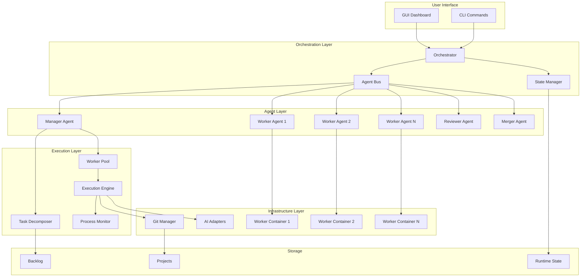
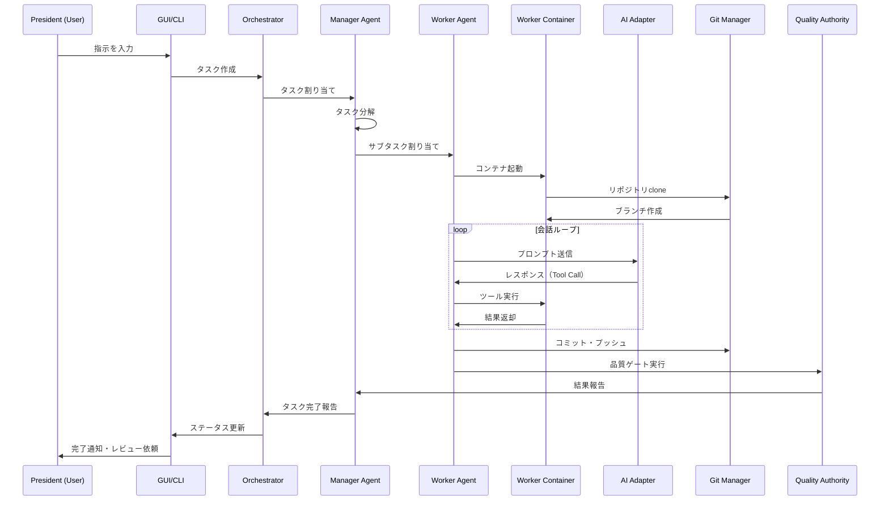

# Design Document: Agent Execution Engine

## Overview

エージェント実行エンジンは、AgentCompanyの中核機能として、社長（ユーザー）からの指示を受け取り、上司エージェント（Manager）が部下エージェント（Worker）に作業を割り振り、実際のコード生成・ファイル操作を行うシステムである。

### 設計目標

1. **会社組織モデル**: 社長→上司→部下の階層構造を忠実に実装
2. **並列実行**: 依存関係のないタスクを複数ワーカーで同時実行
3. **隔離性**: 各ワーカーは専用Dockerコンテナで作業し、完了後は破棄
4. **Git統合**: ブランチ管理、コンフリクト解決、PRベースのマージフロー
5. **リアルタイム監視**: GUIからの状況確認と介入
6. **拡張性**: 複数AIアダプタ対応、エージェントの動的追加

### 設計方針

- **コンテナランタイム抽象化**: DoD（デフォルト）、Rootless、DINDを切り替え可能
- **メッセージキュー抽象化**: ファイルベース（デフォルト）、SQLite、Redisを切り替え可能
- **Git認証の最小権限化**: Deploy key、リポジトリスコープトークン推奨
- **状態永続化**: 中断・再開をサポートするため状態をファイルに保存
- **アダプタ拡張性**: AIアダプタは共通インターフェースで抽象化（1行追加で新アダプタ対応）

## Architecture

### システム全体図



### レイヤー構成

| レイヤー | 責務 | 主要コンポーネント |
|---------|------|-------------------|
| User Interface | ユーザーとの対話 | GUI Dashboard, CLI |
| Orchestration | 全体制御・状態管理 | Orchestrator, Agent Bus, State Manager |
| Agent | タスク実行の主体 | Manager, Worker, Reviewer, Merger |
| Execution | 実行制御 | Execution Engine, Task Decomposer, Worker Pool |
| Infrastructure | 基盤サービス | Docker Containers, Git Manager, AI Adapters |
| Storage | データ永続化 | Runtime State, Backlog, Projects |

### 実行フロー



## Components and Interfaces

### 1. Orchestrator

全体の制御を担当するメインコンポーネント。

```typescript
interface Orchestrator {
  // タスク管理
  submitTask(instruction: string, projectId: string): Promise<TaskId>;
  getTaskStatus(taskId: TaskId): Promise<TaskStatus>;
  cancelTask(taskId: TaskId): Promise<void>;
  resumeTask(runId: RunId): Promise<void>;
  
  // エージェント管理
  getActiveAgents(): Promise<AgentInfo[]>;
  pauseAllAgents(): Promise<void>;
  resumeAllAgents(): Promise<void>;
  emergencyStop(): Promise<void>;
  
  // 設定
  updateConfig(config: SystemConfig): Promise<void>;
  getConfig(): Promise<SystemConfig>;
}
```

**実装場所**: `tools/cli/lib/execution/orchestrator.ts`

### 2. Agent Bus

エージェント間のメッセージパッシングを担当。pull/pollモデルでワーカーは受信ポート不要。

```typescript
// メッセージキュー抽象化
interface MessageQueue {
  type: 'file' | 'sqlite' | 'redis';
  
  // ファイルベース（デフォルト）
  basePath?: string;  // runtime/state/bus/
  
  // SQLite
  dbPath?: string;
  
  // Redis（分散デプロイ用）
  redisUrl?: string;
}

interface AgentBus {
  // キュー設定
  setMessageQueue(queue: MessageQueue): void;
  
  // メッセージ送受信（pull/pollモデル）
  send(message: AgentMessage): Promise<void>;
  poll(agentId: AgentId, timeout?: number): Promise<AgentMessage[]>;
  
  // ブロードキャスト
  broadcast(message: AgentMessage): Promise<void>;
  
  // 履歴
  getMessageHistory(runId: RunId): Promise<AgentMessage[]>;
}

interface AgentMessage {
  id: string;
  type: 'task_assign' | 'task_complete' | 'task_failed' | 'escalate' | 'status_request' | 'status_response';
  from: AgentId;
  to: AgentId;
  payload: unknown;
  timestamp: string;
}
```

**実装場所**: `tools/cli/lib/execution/agent-bus.ts`, `tools/cli/lib/execution/message-queue.ts`

**設計上の制約**:
- ワーカーは受信ポートを持たない（pull/pollモデル）
- デフォルトはファイルベースキュー（Windows/WSL2互換性のため）
- Docker networkingは使用しない

### 3. Manager Agent

タスクの分解と割り振りを担当する上司エージェント。

```typescript
interface ManagerAgent {
  // タスク管理
  receiveTask(task: Task): Promise<void>;
  decomposeTask(task: Task): Promise<SubTask[]>;
  assignTask(subTask: SubTask, workerId: AgentId): Promise<void>;
  
  // 監視・サポート
  monitorProgress(): Promise<ProgressReport>;
  handleEscalation(escalation: Escalation): Promise<void>;
  provideSupport(workerId: AgentId, issue: Issue): Promise<Guidance>;
  
  // ワーカー管理
  hireWorker(spec: WorkerSpec): Promise<AgentId>;
  fireWorker(workerId: AgentId): Promise<void>;
}
```

**実装場所**: `tools/cli/lib/execution/agents/manager.ts`

### 4. Worker Agent

実際のコード生成・ファイル操作を行う部下エージェント。

```typescript
interface WorkerAgent {
  // タスク実行
  executeTask(task: SubTask): Promise<ExecutionResult>;
  
  // ツール呼び出し
  readFile(path: string): Promise<string>;
  writeFile(path: string, content: string): Promise<void>;
  editFile(path: string, edits: FileEdit[]): Promise<void>;
  runCommand(command: string, timeout?: number): Promise<CommandResult>;
  
  // Git操作
  gitCommit(message: string): Promise<void>;
  gitStatus(): Promise<GitStatus>;
  
  // 状態
  getStatus(): Promise<WorkerStatus>;
  pause(): Promise<void>;
  resume(): Promise<void>;
}
```

**実装場所**: `tools/cli/lib/execution/agents/worker.ts`

### 5. Task Decomposer

大雑把な指示を独立したサブタスクに分解。

```typescript
interface TaskDecomposer {
  // 分解
  decompose(instruction: string, context: ProjectContext): Promise<SubTask[]>;
  
  // 依存関係分析
  analyzeDependencies(tasks: SubTask[]): Promise<DependencyGraph>;
  
  // 並列化可能性判定
  identifyParallelizable(tasks: SubTask[]): Promise<SubTask[][]>;
}

interface SubTask {
  id: string;
  parentId: string;
  title: string;
  description: string;
  acceptanceCriteria: string[];
  estimatedEffort: 'small' | 'medium' | 'large';
  assignee?: AgentId;
  status: TaskStatus;
}
```

**実装場所**: `tools/cli/lib/execution/decomposer.ts`

### 6. Worker Pool

ワーカーエージェントのプール管理。

```typescript
// コンテナランタイム抽象化
interface ContainerRuntime {
  type: 'dod' | 'rootless' | 'dind';
  
  // DoD（デフォルト）: ホストのdocker.sockを使用
  // allowlistでコマンド制限（run, stop, rm, logs, inspect のみ）
  dockerSocketPath?: string;
  allowedCommands?: string[];
  
  // Rootless: privileged不要の環境向け
  rootlessPath?: string;
  
  // DIND: CI環境向け（明示的オプトイン）
  dindImage?: string;
}

interface WorkerPool {
  // ランタイム設定
  setContainerRuntime(runtime: ContainerRuntime): void;
  
  // ワーカー管理
  getAvailableWorker(): Promise<WorkerAgent | null>;
  releaseWorker(workerId: AgentId): Promise<void>;
  
  // プール状態
  getPoolStatus(): Promise<PoolStatus>;
  setMaxWorkers(count: number): Promise<void>;
  
  // コンテナ管理（Container Runtime Abstraction経由）
  createWorkerContainer(workerId: AgentId): Promise<ContainerId>;
  destroyWorkerContainer(containerId: ContainerId): Promise<void>;
}

interface PoolStatus {
  totalWorkers: number;
  activeWorkers: number;
  idleWorkers: number;
  pendingTasks: number;
  containerRuntime: string;
}
```

**実装場所**: `tools/cli/lib/execution/worker-pool.ts`, `tools/cli/lib/execution/container-runtime.ts`

**セキュリティ制約**:
- DoD使用時、docker.sockアクセスはallowlistで制限
- ワーカー間でファイルシステム・ネットワーク共有なし
- リポジトリはコンテナ内にclone（ホストbind mountではない）

### 7. Git Manager

Gitリポジトリの操作を担当。

```typescript
interface GitCredentialProvider {
  type: 'deploy_key' | 'token' | 'ssh_agent';
  
  // Deploy key方式
  deployKeyPath?: string;
  
  // Token方式
  token?: string;
  tokenType?: 'github_pat' | 'gitlab_token' | 'generic';
  
  // SSH agent forwarding（開発環境のみ、明示的オプトイン）
  sshAgentEnabled?: boolean;
}

interface GitManager {
  // 認証設定
  setCredentialProvider(provider: GitCredentialProvider): void;
  
  // リポジトリ操作（コンテナローカルストレージへclone）
  clone(url: string, targetDir: string): Promise<void>;
  createBranch(branchName: string): Promise<void>;
  checkout(branchName: string): Promise<void>;
  
  // 変更操作
  stage(files: string[]): Promise<void>;
  commit(message: string): Promise<string>; // commit hash
  push(branchName: string): Promise<void>;
  
  // コンフリクト
  hasConflicts(): Promise<boolean>;
  getConflicts(): Promise<ConflictInfo[]>;
  resolveConflict(file: string, resolution: string): Promise<void>;
  
  // PR
  createPullRequest(title: string, body: string, targetBranch: string): Promise<PullRequestId>;
  
  // セキュリティ
  validateKnownHosts(host: string): Promise<boolean>;
}
```

**実装場所**: `tools/cli/lib/execution/git-manager.ts`, `tools/cli/lib/execution/git-credentials.ts`

**セキュリティ制約**:
- `~/.ssh/` をコンテナに直接マウントしない
- Deploy key（読み取り専用）またはリポジトリスコープトークン推奨
- SSH agent forwarding は開発環境のみ、明示的オプトインで許可

### 8. Process Monitor

コマンド実行の監視と制御。

```typescript
interface ProcessMonitor {
  // コマンド実行
  execute(command: string, options: ExecuteOptions): Promise<CommandResult>;
  executeBackground(command: string): Promise<ProcessId>;
  
  // プロセス制御
  kill(processId: ProcessId): Promise<void>;
  getProcessStatus(processId: ProcessId): Promise<ProcessStatus>;
  
  // 検証
  isInteractiveCommand(command: string): boolean;
  isServerCommand(command: string): boolean;
}

interface ExecuteOptions {
  timeout?: number;        // デフォルト: 300秒
  cwd?: string;
  env?: Record<string, string>;
}

interface CommandResult {
  exitCode: number;
  stdout: string;
  stderr: string;
  timedOut: boolean;
}
```

**実装場所**: `tools/cli/lib/execution/process-monitor.ts`

### 9. AI Adapter Interface

複数AIプロバイダーの抽象化インターフェース（既存のbase.tsを拡張）。

```typescript
interface AIAdapter {
  readonly name: string;
  
  // 生成
  generate(options: GenerateOptions): Promise<AdapterResponse>;
  chat(options: ChatOptions): Promise<AdapterResponse>;
  
  // ツール呼び出し対応
  chatWithTools(options: ChatWithToolsOptions): Promise<ToolCallResponse>;
  
  // 状態
  isAvailable(): Promise<boolean>;
  getModelInfo(): Promise<ModelInfo>;
}

interface ChatWithToolsOptions extends ChatOptions {
  tools: ToolDefinition[];
}

interface ToolCallResponse extends AdapterResponse {
  toolCalls?: ToolCall[];
}

interface ToolCall {
  id: string;
  name: string;
  arguments: Record<string, unknown>;
}
```

**実装場所**: `tools/adapters/base.ts`（拡張）

### 10. State Manager

状態の永続化と復元。

```typescript
interface StateManager {
  // 状態保存
  saveState(runId: RunId, state: ExecutionState): Promise<void>;
  loadState(runId: RunId): Promise<ExecutionState | null>;
  
  // 履歴
  listRuns(filter?: RunFilter): Promise<RunInfo[]>;
  cleanupOldRuns(retentionDays: number): Promise<void>;
  
  // 設定
  saveConfig(config: SystemConfig): Promise<void>;
  loadConfig(): Promise<SystemConfig>;
}

interface ExecutionState {
  runId: string;
  taskId: string;
  status: 'running' | 'paused' | 'completed' | 'failed';
  workerAssignments: Map<AgentId, SubTask>;
  conversationHistories: Map<AgentId, ConversationHistory>;
  gitBranches: Map<AgentId, string>;
  artifacts: string[];
  lastUpdated: string;
}
```

**実装場所**: `tools/cli/lib/execution/state-manager.ts`

## Data Models

### Task（タスク）

```typescript
interface Task {
  id: string;
  projectId: string;
  instruction: string;           // 社長からの指示
  status: TaskStatus;
  createdAt: string;
  updatedAt: string;
  assignedManager?: AgentId;
  subTasks: SubTask[];
  metadata: {
    priority: 'low' | 'medium' | 'high';
    deadline?: string;
    tags: string[];
  };
}

type TaskStatus = 
  | 'pending'      // 待機中
  | 'decomposing'  // 分解中
  | 'executing'    // 実行中
  | 'reviewing'    // レビュー中
  | 'completed'    // 完了
  | 'failed';      // 失敗
```

### SubTask（サブタスク）

```typescript
interface SubTask {
  id: string;
  parentId: string;
  title: string;
  description: string;
  acceptanceCriteria: string[];
  status: SubTaskStatus;
  assignee?: AgentId;
  runId?: string;
  gitBranch?: string;
  artifacts: string[];
  qualityGateResult?: QualityGateResult;
  createdAt: string;
  updatedAt: string;
}

type SubTaskStatus = 
  | 'pending'
  | 'assigned'
  | 'running'
  | 'quality_check'
  | 'completed'
  | 'failed'
  | 'blocked';
```

### ExecutionResult（実行結果）

```typescript
interface ExecutionResult {
  runId: string;
  ticketId: string;
  agentId: string;
  status: 'success' | 'partial' | 'quality_failed' | 'error';
  startTime: string;
  endTime: string;
  artifacts: ArtifactInfo[];
  gitBranch: string;
  commits: CommitInfo[];
  qualityGates: QualityGateResult;
  errors: ErrorInfo[];
  conversationTurns: number;
  tokensUsed: number;
}

interface ArtifactInfo {
  path: string;
  action: 'created' | 'modified' | 'deleted';
  diff?: string;
}

interface QualityGateResult {
  lint: { passed: boolean; output: string };
  test: { passed: boolean; output: string };
  overall: boolean;
}
```

### AgentConfig（エージェント設定）

```typescript
interface AgentConfig {
  id: string;
  title: string;
  role: 'manager' | 'worker' | 'reviewer' | 'merger';
  responsibilities: string[];
  capabilities: string[];
  persona: string;
  aiConfig: {
    adapter: string;           // 'ollama' | 'gemini' | 'kiro' | etc.
    model: string;
    temperature?: number;
    maxTokens?: number;
  };
  resourceLimits: {
    cpuLimit?: string;         // e.g., '2'
    memoryLimit?: string;      // e.g., '4g'
    timeoutSeconds?: number;
  };
  escalation: {
    to: string;
    conditions: string[];
  };
}
```

### SystemConfig（システム設定）

```typescript
interface SystemConfig {
  // ワーカー設定
  maxConcurrentWorkers: number;      // デフォルト: 3
  defaultTimeout: number;            // デフォルト: 300秒
  workerMemoryLimit: string;         // デフォルト: '4g'
  workerCpuLimit: string;            // デフォルト: '2'
  
  // AI設定
  defaultAiAdapter: string;          // デフォルト: 'ollama'
  defaultModel: string;              // デフォルト: 'llama3'
  
  // コンテナランタイム設定
  containerRuntime: 'dod' | 'rootless' | 'dind';  // デフォルト: 'dod'
  dockerSocketPath?: string;         // DoD用
  allowedDockerCommands: string[];   // デフォルト: ['run', 'stop', 'rm', 'logs', 'inspect']
  
  // メッセージキュー設定
  messageQueueType: 'file' | 'sqlite' | 'redis';  // デフォルト: 'file'
  messageQueuePath?: string;         // ファイルベース用
  
  // Git認証設定
  gitCredentialType: 'deploy_key' | 'token' | 'ssh_agent';  // デフォルト: 'token'
  gitSshAgentEnabled: boolean;       // デフォルト: false（開発環境のみtrue許可）
  
  // その他
  stateRetentionDays: number;        // デフォルト: 7
  integrationBranch: string;         // デフォルト: 'develop'
  autoRefreshInterval: number;       // デフォルト: 5000ms
}
```

### Project（プロジェクト）

```typescript
interface Project {
  id: string;
  name: string;
  gitUrl: string;
  defaultBranch: string;             // e.g., 'main'
  integrationBranch: string;         // e.g., 'develop'
  workDir: string;
  createdAt: string;
  lastUsed: string;
}
```

### ConversationHistory（会話履歴）

```typescript
interface ConversationHistory {
  runId: string;
  agentId: string;
  messages: ConversationMessage[];
  toolCalls: ToolCallRecord[];
  totalTokens: number;
}

interface ConversationMessage {
  role: 'system' | 'user' | 'assistant';
  content: string;
  timestamp: string;
}

interface ToolCallRecord {
  id: string;
  name: string;
  arguments: Record<string, unknown>;
  result: unknown;
  timestamp: string;
  durationMs: number;
}
```


## Correctness Properties

*A property is a characteristic or behavior that should hold true across all valid executions of a system—essentially, a formal statement about what the system should do. Properties serve as the bridge between human-readable specifications and machine-verifiable correctness guarantees.*

### Property 1: Agent Hierarchy Integrity

*For any* agent registered in the system, the agent SHALL have a valid role (manager, worker, reviewer, merger) and the hierarchy relationships SHALL be consistent (workers report to managers, reviewers and mergers are independent).

**Validates: Requirements 1.1, 1.8**

### Property 2: Task Decomposition Independence

*For any* high-level task that is decomposed, all resulting sub-tasks SHALL be independent (no sub-task requires the output of another sub-task as input), enabling parallel execution.

**Validates: Requirements 1.3, 2.1, 2.2, 9.2**

### Property 3: Sub-Task Parent Reference

*For any* sub-task created by the Task_Decomposer, the sub-task SHALL have a valid `parent_id` that references an existing parent task.

**Validates: Requirements 2.4**

### Property 4: Sub-Task File Naming Convention

*For any* sub-task saved to the backlog, the filename SHALL follow the pattern `<parent-id>-<sub-id>.md` and be located in `workflows/backlog/`.

**Validates: Requirements 2.5**

### Property 5: Parent Task Status Transition

*For any* parent task with sub-tasks, when all sub-tasks reach `completed` status, the parent task status SHALL transition to `review`.

**Validates: Requirements 2.6**

### Property 6: Git Naming Conventions

*For any* Git operation performed by the system:
- Branch names SHALL follow the pattern `agent/<ticket-id>-<description>`
- Commit messages SHALL follow the pattern `[<ticket-id>] <description>`

**Validates: Requirements 3.3, 3.5**

### Property 7: Git Operation Logging

*For any* Git operation (clone, branch, commit, push), the operation SHALL be logged to `runtime/runs/<run-id>/git.log` with timestamp and details.

**Validates: Requirements 3.7**

### Property 8: Merge Branch Restriction

*For any* merge operation performed by Merger_Agent, the target branch SHALL be the integration branch (develop/staging) and SHALL NOT be master/main directly.

**Validates: Requirements 4.5, 4.6**

### Property 9: Pull Request Creation on Completion

*For any* ticket where all sub-tasks are completed and quality gates pass, the system SHALL create a Pull Request to master/main branch.

**Validates: Requirements 4.7**

### Property 10: Worker Container Isolation

*For any* two Worker_Containers running concurrently, they SHALL have isolated filesystems and network namespaces (no shared state except through Git).

**Validates: Requirements 5.4**

### Property 11: Worker Container Cleanup

*For any* Worker_Container, when the assigned task completes (success or failure), the container SHALL be destroyed within a reasonable time (configurable, default 60 seconds).

**Validates: Requirements 5.5, 14.5**

### Property 12: Command Timeout Enforcement

*For any* command executed via Process_Monitor with a configured timeout, if the command exceeds the timeout, it SHALL be terminated and the result SHALL indicate `timedOut: true`.

**Validates: Requirements 6.1, 6.2**

### Property 13: Interactive Command Rejection

*For any* command that is classified as interactive (vim, nano, less, etc.), the Process_Monitor SHALL reject execution and return an error.

**Validates: Requirements 6.3**

### Property 14: Server Command Background Execution

*For any* command that is classified as a server command (npm run dev, etc.), the Process_Monitor SHALL execute it in background mode and return a process_id.

**Validates: Requirements 6.4, 6.5**

### Property 15: AI Adapter Fallback

*For any* AI request where the primary adapter fails, the system SHALL attempt to use the configured fallback adapter before reporting failure.

**Validates: Requirements 7.5**

### Property 16: Tool Call Round-Trip

*For any* file written via `write_file` tool call, reading the same file via `read_file` SHALL return the exact content that was written.

**Validates: Requirements 8.2, 8.3**

### Property 17: File Edit Consistency

*For any* file edited via `edit_file` tool call with a valid diff, the resulting file content SHALL match the expected output of applying the diff to the original content.

**Validates: Requirements 8.4**

### Property 18: Message Delivery Guarantee

*For any* message sent via Agent_Bus, the message SHALL be delivered to the target agent and logged to the message history.

**Validates: Requirements 10.1, 10.3, 10.4, 10.5**

### Property 19: Conversation History Persistence Round-Trip

*For any* conversation history saved to disk, loading the history SHALL restore the exact same messages and tool call records.

**Validates: Requirements 11.1, 11.6**

### Property 20: Conversation Loop Termination

*For any* conversation loop, it SHALL terminate when either:
- The AI signals completion, OR
- The maximum iteration count (30) is reached

**Validates: Requirements 11.3**

### Property 21: Partial Completion Status

*For any* task execution that reaches maximum iterations without AI signaling completion, the task status SHALL be set to `partial`.

**Validates: Requirements 11.5**

### Property 22: State Persistence Round-Trip

*For any* execution state saved via State_Manager, loading the state SHALL restore all fields (active tasks, worker assignments, conversation histories, git branches) exactly.

**Validates: Requirements 14.1, 14.2, 14.3**

### Property 23: Execution Result Structure

*For any* Execution_Result output:
- It SHALL be valid JSON
- It SHALL contain all required fields (run_id, ticket_id, agent_id, status, start_time, end_time, artifacts, git_branch, quality_gates, errors)
- The status field SHALL be one of: success, partial, quality_failed, error

**Validates: Requirements 20.1, 20.2, 20.4**

### Property 24: Artifact Collection Completeness

*For any* completed task execution, the artifacts field in Execution_Result SHALL list all files that were created or modified during execution.

**Validates: Requirements 20.3**

### Property 25: Quality Gate Execution Order

*For any* completed task, quality gates SHALL be executed in order: lint first, then test (only if lint passes).

**Validates: Requirements 12.1, 12.2**

### Property 26: Retry with Exponential Backoff

*For any* AI connection failure, the system SHALL retry with delays of 1s, 2s, 4s (exponential backoff) before reporting failure.

**Validates: Requirements 13.1**

### Property 27: Git Credential Isolation

*For any* Worker_Container, the container SHALL NOT have access to the host's `~/.ssh/` directory. Git credentials SHALL be injected via deploy key, token, or SSH agent forwarding (with explicit opt-in).

**Validates: Requirements 3.1, 3.2**

### Property 28: Message Queue Abstraction

*For any* message sent via Agent_Bus, the message SHALL be delivered regardless of the underlying queue implementation (file, SQLite, Redis).

**Validates: Requirements 10.6, 10.7**

### Property 29: Container Runtime Abstraction

*For any* Worker_Container created via Worker_Pool, the container SHALL be created and destroyed correctly regardless of the underlying runtime (DoD, Rootless, DIND).

**Validates: Requirements 5.7, 5.8**

### Property 30: Docker Socket Command Restriction

*For any* Docker command executed via DoD runtime, the command SHALL be in the allowlist (run, stop, rm, logs, inspect). Commands outside the allowlist SHALL be rejected.

**Validates: Requirements 5.9**

## Error Handling

### AI Connection Errors

| Error Type | Handling Strategy | Recovery |
|------------|-------------------|----------|
| Connection timeout | Retry with exponential backoff (1s, 2s, 4s) | After 3 retries, mark task as `error` and notify Manager |
| Model not available | Check available models, fallback to alternative | If no fallback, report to Manager for reassignment |
| Rate limit exceeded | Wait and retry with backoff | Continue after rate limit resets |
| Invalid response | Log error, retry with clarified prompt | After 3 retries, escalate to Manager |

### Tool Call Errors

| Error Type | Handling Strategy | Recovery |
|------------|-------------------|----------|
| File not found | Return error to AI, continue conversation | AI can adjust and retry |
| Permission denied | Return error to AI, log security event | Escalate if repeated |
| Command timeout | Terminate process, return timeout error | AI can adjust command or skip |
| Command failed | Return exit code and stderr to AI | AI can debug and retry |

### Git Errors

| Error Type | Handling Strategy | Recovery |
|------------|-------------------|----------|
| Clone failed | Retry with fresh credentials | After 3 retries, report to Manager |
| Push rejected | Pull and rebase, retry push | If conflict, escalate to Reviewer |
| Merge conflict | Attempt auto-resolve | If fails, escalate to Reviewer_Agent |
| Authentication failed | Check credentials, report to user | Require user intervention |

### Container Errors

| Error Type | Handling Strategy | Recovery |
|------------|-------------------|----------|
| Container creation failed | Retry with resource cleanup | After 3 retries, report to Manager |
| Out of memory | Kill container, report to Manager | Manager can reassign with higher limits |
| Container crash | Collect logs, destroy container | Manager decides retry or reassign |
| Network isolation breach | Immediate termination, security alert | Require admin intervention |

### State Recovery

```typescript
interface RecoveryStrategy {
  // 中断からの再開
  resumeFromCheckpoint(runId: string): Promise<void>;
  
  // ロールバック
  rollbackChanges(runId: string): Promise<void>;
  
  // 部分的な成果物の保存
  savePartialResults(runId: string): Promise<void>;
}
```

## Testing Strategy

### Unit Tests

Unit tests focus on individual components in isolation:

1. **Task Decomposer Tests**
   - Test decomposition of various instruction types
   - Test dependency detection
   - Test sub-task generation format

2. **Process Monitor Tests**
   - Test timeout enforcement
   - Test interactive command detection
   - Test server command detection
   - Test process termination

3. **Git Manager Tests**
   - Test branch naming convention
   - Test commit message format
   - Test conflict detection

4. **State Manager Tests**
   - Test state serialization/deserialization
   - Test cleanup of old states

5. **Agent Bus Tests**
   - Test message routing
   - Test message type handling

### Property-Based Tests

Property-based tests verify universal properties across many generated inputs. Each test runs minimum 100 iterations.

**Testing Framework**: fast-check (TypeScript property-based testing library)

1. **Property Test: Task Decomposition Independence**
   - Generate random high-level tasks
   - Decompose and verify no dependencies between sub-tasks
   - **Feature: agent-execution-engine, Property 2: Task Decomposition Independence**

2. **Property Test: Git Naming Conventions**
   - Generate random ticket IDs and descriptions
   - Verify branch names and commit messages follow patterns
   - **Feature: agent-execution-engine, Property 6: Git Naming Conventions**

3. **Property Test: Tool Call Round-Trip**
   - Generate random file contents
   - Write via write_file, read via read_file
   - Verify content matches
   - **Feature: agent-execution-engine, Property 16: Tool Call Round-Trip**

4. **Property Test: State Persistence Round-Trip**
   - Generate random execution states
   - Save and load via State_Manager
   - Verify all fields match
   - **Feature: agent-execution-engine, Property 22: State Persistence Round-Trip**

5. **Property Test: Conversation History Round-Trip**
   - Generate random conversation histories
   - Save and load
   - Verify messages and tool calls match
   - **Feature: agent-execution-engine, Property 19: Conversation History Persistence Round-Trip**

6. **Property Test: Execution Result Structure**
   - Generate random execution results
   - Serialize to JSON
   - Verify all required fields present and valid
   - **Feature: agent-execution-engine, Property 23: Execution Result Structure**

7. **Property Test: Command Timeout Enforcement**
   - Generate commands with various timeouts
   - Execute and verify timeout behavior
   - **Feature: agent-execution-engine, Property 12: Command Timeout Enforcement**

8. **Property Test: Message Delivery**
   - Generate random agent messages
   - Send via Agent_Bus
   - Verify delivery and logging
   - **Feature: agent-execution-engine, Property 18: Message Delivery Guarantee**

### Integration Tests

Integration tests verify component interactions:

1. **Orchestrator → Manager → Worker Flow**
   - Submit task via Orchestrator
   - Verify Manager receives and decomposes
   - Verify Workers receive assignments

2. **Worker → Container → Git Flow**
   - Assign task to Worker
   - Verify container creation
   - Verify Git operations (clone, branch, commit, push)

3. **Quality Gate Integration**
   - Complete task execution
   - Verify lint and test execution
   - Verify result reporting

4. **State Recovery Flow**
   - Start task execution
   - Simulate interruption
   - Resume and verify state restoration

### E2E Tests

End-to-end tests verify complete workflows:

1. **Full Execution Flow**
   - Submit instruction via GUI
   - Verify decomposition
   - Verify parallel execution
   - Verify quality gates
   - Verify PR creation

2. **Error Recovery Flow**
   - Simulate AI failure
   - Verify retry behavior
   - Verify Manager notification

3. **GUI Dashboard Updates**
   - Start execution
   - Verify real-time status updates
   - Verify activity feed

### Test Configuration

```typescript
// vitest.config.ts additions
export default defineConfig({
  test: {
    // Property-based test configuration
    testTimeout: 60000, // 60 seconds for property tests
    hookTimeout: 30000,
    
    // Coverage requirements
    coverage: {
      branches: 80,
      functions: 80,
      lines: 80,
      statements: 80,
    },
  },
});
```

### Test File Structure

```
tools/cli/lib/execution/
├── __tests__/
│   ├── decomposer.test.ts
│   ├── process-monitor.test.ts
│   ├── git-manager.test.ts
│   ├── state-manager.test.ts
│   ├── agent-bus.test.ts
│   ├── worker-pool.test.ts
│   ├── orchestrator.test.ts
│   └── properties/
│       ├── decomposition.property.test.ts
│       ├── git-naming.property.test.ts
│       ├── tool-roundtrip.property.test.ts
│       ├── state-roundtrip.property.test.ts
│       ├── conversation-roundtrip.property.test.ts
│       ├── execution-result.property.test.ts
│       ├── timeout.property.test.ts
│       └── message-delivery.property.test.ts
```
