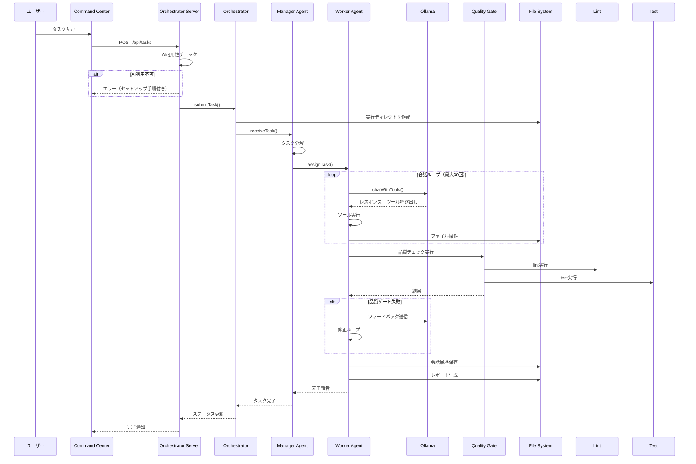

# Design Document: AI Execution Integration

## Overview

本設計は、既存のAI実行インフラ（OllamaAdapter、WorkerAgent、ManagerAgent、Orchestrator）を統合し、GUIからタスクを送信してAIが自律的に作業を完了するE2Eワークフローを実現する。

### 設計目標

1. **E2Eワークフローの完成**: GUI → Orchestrator → AI実行 → 成果物生成の一連のフローを動作させる
2. **可用性確認**: Ollamaの状態確認とエラーハンドリングを強化する
3. **品質ゲート統合**: lint/testの自動実行と結果判定を統合する
4. **成果物管理**: 実行結果のレポート生成と保存を行う

### 既存コンポーネントの活用

本機能は以下の既存コンポーネントを活用・拡張する：

| コンポーネント | 場所 | 役割 |
|---------------|------|------|
| OllamaAdapter | `tools/adapters/ollama.ts` | AI実行基盤との通信 |
| WorkerAgent | `tools/cli/lib/execution/agents/worker.ts` | タスク実行、ツール呼び出し |
| ManagerAgent | `tools/cli/lib/execution/agents/manager.ts` | タスク分解、ワーカー管理 |
| Orchestrator | `tools/cli/lib/execution/orchestrator.ts` | 全体制御、タスク管理 |
| OrchestratorServer | `tools/cli/lib/execution/orchestrator-server.ts` | HTTP API提供 |
| QualityGate | `tools/cli/lib/execution/quality-gate.ts` | 品質チェック |

## Architecture

### システム構成図

```mermaid
graph TB
    subgraph GUI["GUI Layer"]
        CommandCenter[Command Center]
        Dashboard[Dashboard]
        RunsPage[Runs Page]
    end

    subgraph API["API Layer"]
        OrchestratorServer[Orchestrator Server]
        HealthAPI[/api/health/ai]
    end

    subgraph Core["Core Layer"]
        Orchestrator[Orchestrator]
        ManagerAgent[Manager Agent]
        WorkerPool[Worker Pool]
    end

    subgraph Worker["Worker Layer"]
        WorkerAgent[Worker Agent]
        ToolExecutor[Tool Executor]
    end

    subgraph AI["AI Layer"]
        AdapterRegistry[Adapter Registry]
        OllamaAdapter[Ollama Adapter]
        Ollama[(Ollama Server)]
    end

    subgraph Quality["Quality Layer"]
        QualityGate[Quality Gate]
        Lint[ESLint]
        Test[Vitest]
    end

    subgraph Storage["Storage Layer"]
        RunDir[(runtime/runs/)]
        StateDir[(runtime/state/)]
    end

    GUI --> API
    API --> Core
    Core --> Worker
    Worker --> AI
    Worker --> Quality
    Core --> Storage
    AI --> Ollama
```

### 実行フロー図



## Components and Interfaces

### 1. AIHealthChecker

AI実行基盤の可用性を確認するコンポーネント。

```typescript
/**
 * AI可用性チェッカー
 * @see Requirements: 1.1-1.5
 */
interface IAIHealthChecker {
  /** Ollamaの可用性をチェック */
  checkOllamaAvailability(): Promise<AIHealthStatus>;
  
  /** インストール済みモデル一覧を取得 */
  getInstalledModels(): Promise<string[]>;
  
  /** 推奨モデルのインストールコマンドを取得 */
  getModelInstallCommands(): string[];
  
  /** ヘルスステータスを取得 */
  getHealthStatus(): Promise<AIHealthStatus>;
}

interface AIHealthStatus {
  available: boolean;
  ollamaRunning: boolean;
  modelsInstalled: string[];
  recommendedModels: string[];
  setupInstructions?: string;
  lastChecked: string;
}
```

### 2. ExecutionReporter

実行結果のレポート生成を担当するコンポーネント。

```typescript
/**
 * 実行レポーター
 * @see Requirements: 5.1-5.5
 */
interface IExecutionReporter {
  /** レポートを生成 */
  generateReport(runId: string, result: ExecutionResult): Promise<ReportData>;
  
  /** レポートをファイルに保存 */
  saveReport(runId: string, report: ReportData): Promise<void>;
  
  /** 成果物を収集 */
  collectArtifacts(runId: string, artifacts: ArtifactInfo[]): Promise<void>;
}

interface ReportData {
  runId: string;
  taskDescription: string;
  status: ExecutionStatus;
  startTime: string;
  endTime: string;
  duration: number;
  changes: ChangeEntry[];
  testResults: TestResultSummary;
  conversationSummary: string;
  artifacts: string[];
}
```

### 3. QualityGateIntegration

品質ゲートの統合を担当するコンポーネント。

```typescript
/**
 * 品質ゲート統合
 * @see Requirements: 4.1-4.5
 */
interface IQualityGateIntegration {
  /** lint実行 */
  runLint(workspacePath: string): Promise<QualityCheckResult>;
  
  /** test実行 */
  runTests(workspacePath: string): Promise<QualityCheckResult>;
  
  /** 全品質チェック実行 */
  runAllChecks(workspacePath: string): Promise<QualityGateResult>;
  
  /** 結果を保存 */
  saveResults(runId: string, results: QualityGateResult): Promise<void>;
}

interface QualityCheckResult {
  passed: boolean;
  output: string;
  errors: string[];
  warnings: string[];
  duration: number;
}
```

### 4. OrchestratorServer拡張

既存のOrchestratorServerにヘルスチェックエンドポイントを追加。

```typescript
/**
 * 追加エンドポイント
 * @see Requirements: 1.3, 2.1-2.5
 */

// GET /api/health/ai - AI可用性チェック
interface AIHealthResponse {
  success: boolean;
  data: {
    available: boolean;
    ollamaRunning: boolean;
    modelsInstalled: string[];
    recommendedModels: string[];
    setupInstructions?: string;
  };
}

// POST /api/tasks - タスク送信（拡張）
interface SubmitTaskResponse {
  success: boolean;
  data: {
    taskId: string;
    runId: string;
    runDirectory: string;
  };
}
```

## Data Models

### 実行ディレクトリ構造

```
runtime/runs/<run-id>/
├── task.json           # タスクメタデータ
├── conversation.json   # 会話履歴
├── quality.json        # 品質ゲート結果
├── report.md           # 実行レポート
├── errors.log          # エラーログ
└── artifacts/          # 成果物
    ├── file1.ts
    └── file2.ts
```

### タスクメタデータ

```typescript
/**
 * タスクメタデータ
 * @see Requirement 2.5
 */
interface TaskMetadata {
  taskId: string;
  runId: string;
  projectId: string;
  instruction: string;
  status: TaskStatus;
  createdAt: string;
  updatedAt: string;
  aiAdapter: string;
  model: string;
}
```

### 品質ゲート結果

```typescript
/**
 * 品質ゲート結果
 * @see Requirement 4.3
 */
interface QualityGateResultData {
  runId: string;
  timestamp: string;
  lint: {
    passed: boolean;
    output: string;
    errorCount: number;
    warningCount: number;
  };
  test: {
    passed: boolean;
    output: string;
    totalTests: number;
    passedTests: number;
    failedTests: number;
    coverage?: number;
  };
  overall: boolean;
}
```

### 実行レポート

```typescript
/**
 * 実行レポート
 * @see Requirement 5.3
 */
interface ExecutionReport {
  runId: string;
  taskId: string;
  title: string;
  status: ExecutionStatus;
  summary: string;
  timeline: {
    started: string;
    completed: string;
    duration: string;
  };
  changes: {
    created: string[];
    modified: string[];
    deleted: string[];
  };
  qualityGates: {
    lint: { passed: boolean; summary: string };
    test: { passed: boolean; summary: string };
  };
  conversation: {
    turns: number;
    tokensUsed: number;
    summary: string;
  };
  artifacts: string[];
}
```

## Correctness Properties

_A property is a characteristic or behavior that should hold true across all valid executions of a system—essentially, a formal statement about what the system should do. Properties serve as the bridge between human-readable specifications and machine-verifiable correctness guarantees._


### Property 1: AI Unavailability Error Handling

_For any_ system state where Ollama is not available, the health check response SHALL contain a clear error message and setup instructions.

**Validates: Requirements 1.2**

### Property 2: Graceful Degradation on AI Unavailability

_For any_ task execution where the AI adapter becomes unavailable mid-execution, the system SHALL pause the execution and preserve the current state without data loss.

**Validates: Requirements 1.5, 6.3**

### Property 3: Task Submission and Run ID Generation

_For any_ valid task submission via the API, the system SHALL return a unique run ID immediately and the run ID SHALL follow the format `run-<timestamp>-<random>`.

**Validates: Requirements 2.1, 2.2**

### Property 4: Run Directory and Metadata Persistence Round-Trip

_For any_ task submission, the system SHALL create a run directory at `runtime/runs/<run-id>/` and persist task metadata to `task.json`. Loading the metadata SHALL produce an equivalent object.

**Validates: Requirements 2.4, 2.5**

### Property 5: Task Decomposition Independence

_For any_ task received by Manager Agent, the decomposed sub-tasks SHALL be independent and assignable to workers without circular dependencies.

**Validates: Requirements 3.1, 3.2**

### Property 6: Tool Execution from AI Responses

_For any_ tool call requested by the AI, the Worker Agent SHALL execute the tool and return the result to the AI for the next iteration.

**Validates: Requirements 3.3**

### Property 7: Task Completion Notification

_For any_ completed sub-task, the Worker Agent SHALL notify the Manager Agent with the execution result.

**Validates: Requirements 3.4**

### Property 8: Conversation History Persistence Round-Trip

_For any_ Worker Agent execution, the conversation history SHALL be saved to `conversation.json` and loading it SHALL produce an equivalent history object.

**Validates: Requirements 3.5**

### Property 9: Worker Failure Retry with Exponential Backoff

_For any_ Worker Agent failure, the system SHALL retry with exponential backoff (1s, 2s, 4s) up to 3 times before escalating.

**Validates: Requirements 3.6**

### Property 10: Quality Gate Sequential Execution

_For any_ code change completion, the system SHALL run lint first, and if lint passes, run tests. Results SHALL be persisted to `quality.json`.

**Validates: Requirements 4.1, 4.2, 4.3**

### Property 11: Quality Gate Feedback Loop

_For any_ quality gate failure, the Worker Agent SHALL receive failure details and attempt to fix the issues in subsequent iterations.

**Validates: Requirements 4.4, 4.5**

### Property 12: Artifact Collection and Report Completeness

_For any_ completed task, the system SHALL collect all artifacts to the run directory and generate a report containing: task description, changes made, test results, and conversation summary.

**Validates: Requirements 5.1, 5.2, 5.3, 5.4**

### Property 13: Error Logging and Failure Reporting

_For any_ error during execution, the error SHALL be logged to `errors.log`. For permanent failures, a failure report SHALL be generated.

**Validates: Requirements 6.1, 6.5**

### Property 14: Settings Validation

_For any_ settings update, the system SHALL validate the settings before saving. Invalid settings SHALL be rejected with a clear error message.

**Validates: Requirements 8.4**

### Property 15: Settings Hot-Reload

_For any_ valid settings change, the system SHALL apply the new settings without requiring a restart.

**Validates: Requirements 8.5**

## Error Handling

### エラーカテゴリ

| カテゴリ | 説明 | 対応 |
|---------|------|------|
| `ai_unavailable` | AI実行基盤が利用不可 | セットアップ手順を表示、一時停止 |
| `ai_timeout` | AIレスポンスタイムアウト | リトライ（指数バックオフ） |
| `tool_execution` | ツール実行エラー | AIにエラーを報告、続行 |
| `quality_gate` | 品質ゲート失敗 | AIにフィードバック、修正ループ |
| `persistence` | 状態保存エラー | リトライ後、緊急停止 |

### リトライ戦略

```typescript
const RETRY_CONFIG = {
  maxAttempts: 3,
  initialDelayMs: 1000,
  backoffMultiplier: 2,
  maxDelayMs: 4000,
};
```

### エラーメッセージテンプレート

```typescript
const ERROR_MESSAGES = {
  ollamaNotRunning: `
Ollamaが起動していません。

セットアップ手順:
1. Ollamaをインストール: https://ollama.ai/download
2. Ollamaを起動: ollama serve
3. モデルをインストール: ollama pull llama3.2:1b
`,
  noModelsInstalled: `
Ollamaにモデルがインストールされていません。

推奨モデル:
- ollama pull llama3.2:1b (軽量、高速)
- ollama pull codellama (コード生成向け)
- ollama pull qwen2.5-coder (コード生成向け)
`,
};
```

## Testing Strategy

### テストアプローチ

本機能では、ユニットテストとプロパティベーステストの両方を使用して包括的なテストカバレッジを実現する。

- **ユニットテスト**: 特定の例、エッジケース、エラー条件の検証
- **プロパティテスト**: 全入力に対する普遍的な性質の検証

### プロパティベーステスト設定

- **ライブラリ**: fast-check（既存プロジェクトで使用中）
- **最小イテレーション**: 100回
- **タグ形式**: `Feature: ai-execution-integration, Property N: <property_text>`

### テストファイル構成

```
tests/
├── execution/
│   ├── ai-health-checker.test.ts
│   ├── ai-health-checker.property.test.ts
│   ├── execution-reporter.test.ts
│   ├── execution-reporter.property.test.ts
│   ├── quality-gate-integration.test.ts
│   └── quality-gate-integration.property.test.ts
└── adapters/
    └── ollama.test.ts

e2e/
└── ai-execution-workflow.spec.ts
```

### E2Eテストシナリオ

```typescript
// e2e/ai-execution-workflow.spec.ts
describe('AI Execution Workflow', () => {
  test('complete task execution from GUI to artifacts', async () => {
    // 1. AI可用性確認
    // 2. タスク送信
    // 3. 実行進捗確認
    // 4. 品質ゲート実行
    // 5. 成果物確認
    // 6. レポート確認
  });

  test('graceful handling when AI is unavailable', async () => {
    // 1. Ollamaを停止
    // 2. タスク送信
    // 3. エラーメッセージ確認
    // 4. セットアップ手順確認
  });

  test('quality gate feedback loop', async () => {
    // 1. lint失敗するコードを生成させる
    // 2. フィードバック確認
    // 3. 修正ループ確認
  });
});
```

### カバレッジ目標

| 種別 | 目標 |
|------|------|
| ステートメント | 80% |
| ブランチ | 75% |
| 関数 | 85% |
| 行 | 80% |

### テスト実行コマンド

```bash
# ユニットテスト
npm run test -- --filter="ai-health"

# プロパティテスト
npm run test -- --filter="property"

# E2Eテスト
npm run e2e -- --grep="ai-execution"

# 全テスト
make ci
```
