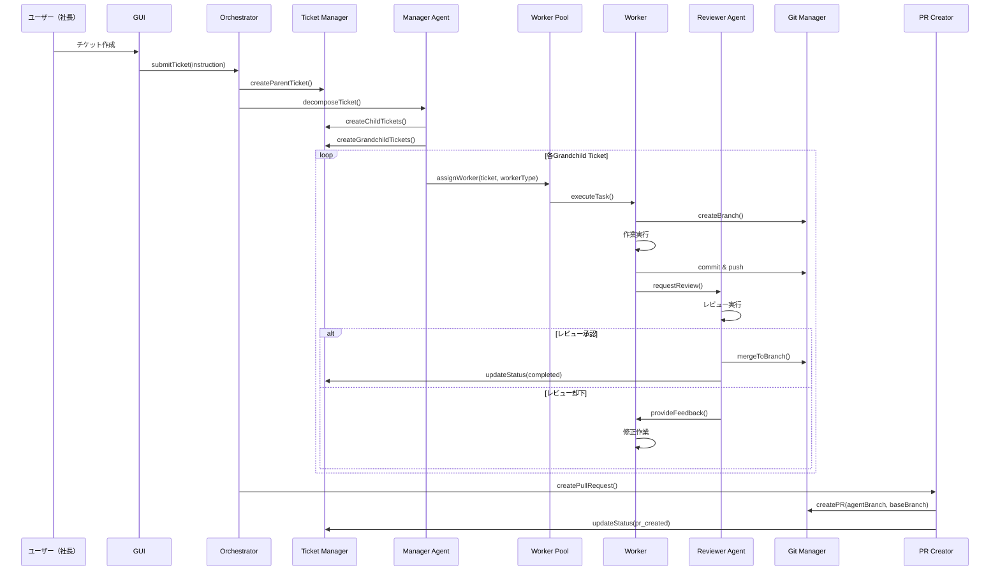
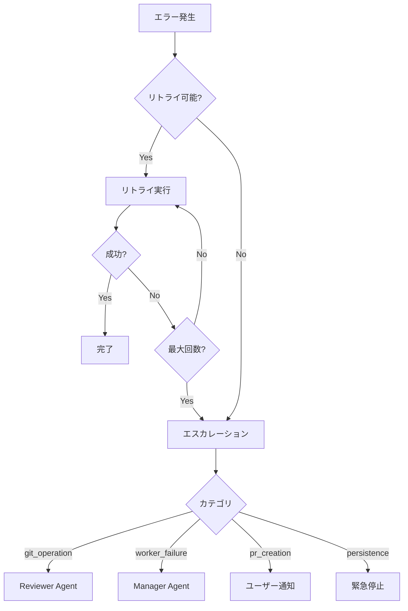

# Design Document: Autonomous Agent Workflow

## Overview

本設計は、AIエージェントが自律的にGitリポジトリに対して開発作業を行い、Pull Requestを作成するワークフローを実現する。

### 設計目標

1. **階層的タスク管理**: 社長の指示を段階的に分解し、専門ワーカーに割り当てる
2. **安全なGit操作**: ブランチ戦略により作業を隔離し、レビュー後にマージする
3. **自律的実行**: 人間の介入を最小限に抑えつつ、品質を確保する
4. **可視化**: GUIでプロジェクトとチケットの状態を確認できる

### 既存コンポーネントとの統合

本機能は以下の既存コンポーネントを拡張・活用する：

- `ProjectManager`: プロジェクト管理（ブランチ設定を追加）
- `GitManager`: Git操作（PR作成機能を追加）
- `Orchestrator`: 全体制御（チケット階層管理を追加）
- `WorkerPool`: ワーカー管理（ワーカータイプ対応を追加）
- `AgentBus`: エージェント間通信（レビューフローを追加）

## Architecture

### システム構成図

```mermaid
graph TB
    subgraph GUI["GUI Layer"]
        ProjectPage[Project Management]
        TicketPage[Ticket Hierarchy]
        CreatePage[Ticket Creation]
    end

    subgraph API["API Layer"]
        ProjectAPI[/api/projects]
        TicketAPI[/api/tickets]
        WorkflowAPI[/api/workflow]
    end

    subgraph Core["Core Layer"]
        Orchestrator[Orchestrator]
        TicketManager[Ticket Manager]
        ProjectManager[Project Manager]
        WorkerPool[Worker Pool]
    end

    subgraph Workers["Worker Layer"]
        ResearchWorker[Research Worker]
        DesignWorker[Design Worker]
        DesignerWorker[Designer Worker]
        DeveloperWorker[Developer Worker]
        TestWorker[Test Worker]
        ReviewerAgent[Reviewer Agent]
    end

    subgraph Git["Git Layer"]
        GitManager[Git Manager]
        PRCreator[PR Creator]
    end

    subgraph Storage["Storage Layer"]
        ProjectsJSON[(projects.json)]
        TicketsJSON[(tickets/*.json)]
        StateJSON[(state/*.json)]
    end

    GUI --> API
    API --> Core
    Core --> Workers
    Core --> Git
    Core --> Storage
    Workers --> Git
```

### ワークフロー図



## Components and Interfaces

### 1. TicketManager

チケットの階層構造を管理するコンポーネント。

```typescript
/**
 * チケット管理インターフェース
 * @see Requirements: 2.1-2.8
 */
interface ITicketManager {
  // 親チケット操作
  createParentTicket(projectId: string, instruction: string): Promise<ParentTicket>;
  getParentTicket(ticketId: string): Promise<ParentTicket | null>;
  listParentTickets(projectId: string): Promise<ParentTicket[]>;

  // 子チケット操作
  createChildTicket(parentId: string, data: ChildTicketData): Promise<ChildTicket>;
  getChildTicket(ticketId: string): Promise<ChildTicket | null>;

  // 孫チケット操作
  createGrandchildTicket(parentId: string, data: GrandchildTicketData): Promise<GrandchildTicket>;
  getGrandchildTicket(ticketId: string): Promise<GrandchildTicket | null>;

  // ステータス管理
  updateTicketStatus(ticketId: string, status: TicketStatus): Promise<void>;
  propagateStatusToParent(ticketId: string): Promise<void>;

  // 永続化
  saveTickets(projectId: string): Promise<void>;
  loadTickets(projectId: string): Promise<void>;
}
```

### 2. ProjectManager拡張

既存のProjectManagerにブランチ設定を追加。

```typescript
/**
 * 拡張プロジェクト型
 * @see Requirements: 1.1-1.5
 */
interface ExtendedProject extends Project {
  /** PRの作成先ブランチ（デフォルト: 'main'） */
  baseBranch: string;
  /** エージェント作業用ブランチ（デフォルト: 'agent/<project-id>'） */
  agentBranch: string;
}

/**
 * プロジェクト登録オプション拡張
 */
interface ExtendedAddProjectOptions extends AddProjectOptions {
  baseBranch?: string;
  agentBranch?: string;
}
```

### 3. WorkerTypeRegistry

ワーカータイプの定義と管理。

```typescript
/**
 * ワーカータイプ
 * @see Requirements: 3.1-3.8
 */
type WorkerType = 'research' | 'design' | 'designer' | 'developer' | 'test' | 'reviewer';

/**
 * ワーカータイプ設定
 */
interface WorkerTypeConfig {
  type: WorkerType;
  capabilities: string[];
  tools: string[];
  persona: string;
  aiConfig: {
    adapter: string;
    model: string;
    temperature: number;
  };
}

/**
 * ワーカータイプレジストリ
 */
interface IWorkerTypeRegistry {
  getConfig(type: WorkerType): WorkerTypeConfig;
  getCapabilities(type: WorkerType): string[];
  matchWorkerType(taskDescription: string): WorkerType;
}
```

### 4. PRCreator

Pull Request作成を担当するコンポーネント。

```typescript
/**
 * PR作成インターフェース
 * @see Requirements: 10.1-10.6
 */
interface IPRCreator {
  createPullRequest(options: CreatePROptions): Promise<PRResult>;
  getPRStatus(prId: string): Promise<PRStatus>;
}

interface CreatePROptions {
  projectId: string;
  sourceBranch: string;
  targetBranch: string;
  title: string;
  body: string;
  tickets: string[];
}

interface PRResult {
  success: boolean;
  prId?: string;
  prUrl?: string;
  error?: string;
}
```

### 5. ReviewWorkflow

レビューワークフローを管理するコンポーネント。

```typescript
/**
 * レビューワークフローインターフェース
 * @see Requirements: 5.1-5.6
 */
interface IReviewWorkflow {
  requestReview(ticketId: string, workerId: string): Promise<void>;
  submitReview(ticketId: string, decision: ReviewDecision): Promise<void>;
  getReviewStatus(ticketId: string): Promise<ReviewStatus>;
}

interface ReviewDecision {
  approved: boolean;
  feedback?: string;
  checklist: {
    codeQuality: boolean;
    testCoverage: boolean;
    acceptanceCriteria: boolean;
  };
}
```

## Data Models

### チケット階層モデル

```typescript
/**
 * チケットステータス
 */
type TicketStatus =
  | 'pending' // 待機中
  | 'decomposing' // 分解中
  | 'in_progress' // 実行中
  | 'review_requested' // レビュー待ち
  | 'revision_required' // 修正要求
  | 'completed' // 完了
  | 'failed' // 失敗
  | 'pr_created'; // PR作成済み

/**
 * 親チケット（社長の指示）
 * @see Requirement 2.5
 */
interface ParentTicket {
  id: string; // 例: "proj-001-0001"
  projectId: string;
  instruction: string; // 社長からの指示
  status: TicketStatus;
  createdAt: string;
  updatedAt: string;
  childTickets: ChildTicket[];
  metadata: {
    priority: 'low' | 'medium' | 'high';
    deadline?: string;
    tags: string[];
  };
}

/**
 * 子チケット（部長が分解）
 * @see Requirement 2.6
 */
interface ChildTicket {
  id: string; // 例: "proj-001-0001-01"
  parentId: string;
  title: string;
  description: string;
  status: TicketStatus;
  workerType: WorkerType; // 担当ワーカータイプ
  createdAt: string;
  updatedAt: string;
  grandchildTickets: GrandchildTicket[];
}

/**
 * 孫チケット（実作業）
 * @see Requirement 2.7
 */
interface GrandchildTicket {
  id: string; // 例: "proj-001-0001-01-001"
  parentId: string;
  title: string;
  description: string;
  acceptanceCriteria: string[];
  status: TicketStatus;
  assignee?: string; // ワーカーID
  gitBranch?: string; // 作業ブランチ名
  artifacts: string[]; // 成果物パス
  reviewResult?: ReviewResult;
  createdAt: string;
  updatedAt: string;
}
```

### 拡張プロジェクトモデル

```typescript
/**
 * 拡張プロジェクト
 * @see Requirements: 1.1-1.5
 */
interface ExtendedProject {
  id: string;
  name: string;
  gitUrl: string;
  defaultBranch: string; // 既存フィールド
  integrationBranch: string; // 既存フィールド
  baseBranch: string; // 新規: PRの作成先（デフォルト: 'main'）
  agentBranch: string; // 新規: エージェント作業用（デフォルト: 'agent/<id>'）
  workDir: string;
  createdAt: string;
  lastUsed: string;
}
```

### レビュー結果モデル

```typescript
/**
 * レビュー結果
 * @see Requirements: 5.1-5.6
 */
interface ReviewResult {
  reviewerId: string;
  approved: boolean;
  feedback?: string;
  checklist: {
    codeQuality: boolean;
    testCoverage: boolean;
    acceptanceCriteria: boolean;
  };
  reviewedAt: string;
}
```

### 状態永続化モデル

```typescript
/**
 * チケット永続化データ
 * @see Requirement 9.1
 */
interface TicketPersistenceData {
  projectId: string;
  parentTickets: ParentTicket[];
  lastUpdated: string;
}

/**
 * 実行状態永続化データ
 * @see Requirement 9.2
 */
interface ExecutionPersistenceData {
  runId: string;
  ticketId: string;
  status: 'running' | 'paused' | 'completed' | 'failed';
  workerStates: Record<string, WorkerState>;
  conversationHistories: Record<string, ConversationHistory>;
  gitBranches: Record<string, string>;
  lastUpdated: string;
}
```

## API設計

### REST API エンドポイント

```typescript
// プロジェクト管理
GET    /api/projects                    // プロジェクト一覧
POST   /api/projects                    // プロジェクト作成
GET    /api/projects/:id                // プロジェクト詳細
PUT    /api/projects/:id                // プロジェクト更新
DELETE /api/projects/:id                // プロジェクト削除

// チケット管理
GET    /api/projects/:projectId/tickets           // チケット一覧
POST   /api/projects/:projectId/tickets           // 親チケット作成
GET    /api/tickets/:ticketId                     // チケット詳細
PUT    /api/tickets/:ticketId/status              // ステータス更新
POST   /api/tickets/:ticketId/pause               // 一時停止
POST   /api/tickets/:ticketId/resume              // 再開

// ワークフロー
POST   /api/tickets/:ticketId/review              // レビュー依頼
POST   /api/tickets/:ticketId/review/submit       // レビュー結果送信
GET    /api/tickets/:ticketId/review/status       // レビュー状態取得
```

## Correctness Properties

_A property is a characteristic or behavior that should hold true across all valid executions of a system—essentially, a formal statement about what the system should do. Properties serve as the bridge between human-readable specifications and machine-verifiable correctness guarantees._

### Property 1: Project Structure Completeness

_For any_ project created or loaded from storage, the project object SHALL contain both `baseBranch` and `agentBranch` fields with valid string values, where `agentBranch` follows the format `agent/<project-id>` if using default.

**Validates: Requirements 1.1, 1.2**

### Property 2: Project Persistence Round-Trip

_For any_ valid project configuration, saving to `workspaces/projects.json` and then loading SHALL produce an equivalent project object.

**Validates: Requirements 1.5**

### Property 3: Hierarchical Ticket ID Generation

_For any_ ticket created at any level (parent, child, grandchild), the generated ID SHALL:

- For parent tickets: follow format `<project-id>-<sequence>`
- For child tickets: follow format `<parent-id>-<sequence>`
- For grandchild tickets: follow format `<child-id>-<sequence>`

And all generated IDs SHALL be unique within the project.

**Validates: Requirements 2.2, 2.3, 2.4**

### Property 4: Ticket Structure Completeness

_For any_ ticket at any level, the ticket object SHALL contain all required fields:

- Parent: id, projectId, instruction, status, createdAt, childTickets[]
- Child: id, parentId, title, description, status, workerType, grandchildTickets[]
- Grandchild: id, parentId, title, description, acceptanceCriteria[], status, assignee, gitBranch, artifacts[]

**Validates: Requirements 2.5, 2.6, 2.7**

### Property 5: Status Propagation

_For any_ ticket hierarchy, when all child tickets reach 'completed' status, the parent ticket status SHALL be updated to reflect completion (or 'pr_created' for parent tickets after PR creation).

**Validates: Requirements 2.8**

### Property 6: Worker Type Validation

_For any_ worker type assignment, the type SHALL be one of: 'research', 'design', 'designer', 'developer', 'test', 'reviewer'.

**Validates: Requirements 3.1**

### Property 7: Git Naming Conventions

_For any_ grandchild ticket execution:

- The created branch name SHALL follow format `agent/<ticket-id>-<description>`
- The commit message SHALL follow format `[<ticket-id>] <description>`

**Validates: Requirements 4.1, 4.2**

### Property 8: Merge Flow Integrity

_For any_ approved review, the task branch changes SHALL be present in the agent branch after merge operation completes.

**Validates: Requirements 4.4**

### Property 9: Conflict Escalation

_For any_ merge conflict that cannot be automatically resolved, the system SHALL escalate to Reviewer_Agent with conflict details before failing.

**Validates: Requirements 4.5, 4.6**

### Property 10: Review Decision Handling

_For any_ review decision:

- If approved: merge to agent branch SHALL be triggered
- If rejected: ticket status SHALL be updated to 'revision_required' and feedback SHALL be provided

**Validates: Requirements 5.3, 5.4, 5.5**

### Property 11: Review Logging

_For any_ review decision, the decision details SHALL be logged to `runtime/runs/<run-id>/reviews.log`.

**Validates: Requirements 5.6**

### Property 12: Form Validation Behavior

_For any_ form submission with invalid input, the GUI SHALL reject the submission and display a clear error message.

**Validates: Requirements 6.5, 6.6**

### Property 13: Ticket Status Color Mapping

_For any_ ticket status, the GUI SHALL display the correct color indicator:

- pending: gray
- in_progress: blue
- review_requested: yellow
- completed: green
- failed: red

**Validates: Requirements 7.2**

### Property 14: Ticket Information Display

_For any_ ticket displayed in the GUI, the display SHALL include:

- Worker type and assignee (for assigned tickets)
- Git branch name (for grandchild tickets with branches)

**Validates: Requirements 7.4, 7.5**

### Property 15: State Persistence Round-Trip

_For any_ execution state (tickets and run state), saving to the designated JSON files and then loading SHALL produce equivalent state objects.

**Validates: Requirements 9.1, 9.2**

### Property 16: Pause/Resume State Preservation

_For any_ paused ticket, resuming SHALL restore all worker state and conversation history to the exact state before pause.

**Validates: Requirements 9.4, 9.5**

### Property 17: PR Creation Trigger

_For any_ parent ticket where all grandchild tickets are completed, a Pull Request SHALL be created from agent branch to base branch.

**Validates: Requirements 10.1**

### Property 18: PR Content Completeness

_For any_ created Pull Request:

- Title SHALL follow format `[AgentCompany] <summary>`
- Body SHALL include: overview, list of changes, test results, related tickets

**Validates: Requirements 10.2, 10.3**

### Property 19: PR Status Update

_For any_ successful PR creation, the parent ticket status SHALL be updated to 'pr_created'.

**Validates: Requirements 10.5**

### Property 20: Exponential Backoff Retry

_For any_ worker failure, the system SHALL retry with delays of 1s, 2s, 4s (exponential backoff) up to 3 times before marking as failed.

**Validates: Requirements 11.1, 11.2**

### Property 21: Error Audit Logging

_For any_ error that occurs during execution, the error details SHALL be logged to `runtime/runs/<run-id>/errors.log`.

**Validates: Requirements 11.5**

## Error Handling

### エラーカテゴリ

| カテゴリ         | 説明               | 対応                                         |
| ---------------- | ------------------ | -------------------------------------------- |
| `git_operation`  | Git操作の失敗      | リトライ後、エスカレーション                 |
| `worker_failure` | ワーカー実行の失敗 | リトライ後、再割り当てまたはエスカレーション |
| `review_failure` | レビュー処理の失敗 | リトライ後、Manager Agentに通知              |
| `pr_creation`    | PR作成の失敗       | リトライ後、ユーザーに通知                   |
| `persistence`    | 状態保存の失敗     | リトライ後、緊急停止                         |
| `validation`     | 入力検証の失敗     | エラーメッセージを返却                       |

### リトライ戦略

```typescript
const RETRY_CONFIG = {
  maxAttempts: 3,
  initialDelayMs: 1000,
  backoffMultiplier: 2,
  maxDelayMs: 4000,
};
```

### エスカレーションフロー



### ログ形式

```typescript
interface ErrorLogEntry {
  timestamp: string;
  runId: string;
  ticketId: string;
  category: ErrorCategory;
  message: string;
  stack?: string;
  retryCount: number;
  resolved: boolean;
  resolution?: string;
}
```

## Testing Strategy

### テストアプローチ

本機能では、ユニットテストとプロパティベーステストの両方を使用して包括的なテストカバレッジを実現する。

- **ユニットテスト**: 特定の例、エッジケース、エラー条件の検証
- **プロパティテスト**: 全入力に対する普遍的な性質の検証

### プロパティベーステスト設定

- **ライブラリ**: fast-check（既存プロジェクトで使用中）
- **最小イテレーション**: 100回
- **タグ形式**: `Feature: autonomous-agent-workflow, Property N: <property_text>`

### テストファイル構成

```
tests/
├── execution/
│   ├── ticket-manager.test.ts           # ユニットテスト
│   ├── ticket-manager.property.test.ts  # プロパティテスト
│   ├── pr-creator.test.ts
│   ├── pr-creator.property.test.ts
│   ├── review-workflow.test.ts
│   └── review-workflow.property.test.ts
├── project-manager-extended.test.ts
└── project-manager-extended.property.test.ts

gui/web/
├── lib/
│   └── parsers/
│       ├── ticket.test.ts
│       └── project.test.ts
└── components/
    └── tickets/
        └── TicketTree.test.tsx

e2e/
├── ticket-workflow.spec.ts
└── project-management.spec.ts
```

### プロパティテスト例

```typescript
// Feature: autonomous-agent-workflow, Property 3: Hierarchical Ticket ID Generation
describe('Ticket ID Generation', () => {
  it('should generate unique hierarchical IDs', () => {
    fc.assert(
      fc.property(
        fc.string({ minLength: 1, maxLength: 20 }), // projectId
        fc.array(fc.string({ minLength: 1 }), { minLength: 1, maxLength: 10 }), // instructions
        (projectId, instructions) => {
          const manager = new TicketManager();
          const ids = new Set<string>();

          for (const instruction of instructions) {
            const parent = manager.createParentTicket(projectId, instruction);
            expect(parent.id).toMatch(new RegExp(`^${projectId}-\\d+$`));
            expect(ids.has(parent.id)).toBe(false);
            ids.add(parent.id);
          }

          return true;
        }
      ),
      { numRuns: 100 }
    );
  });
});
```

### ユニットテスト例

```typescript
// 特定のエッジケースをテスト
describe('TicketManager', () => {
  it('should handle empty instruction gracefully', () => {
    const manager = new TicketManager();
    expect(() => manager.createParentTicket('proj-001', '')).toThrow('Instruction is required');
  });

  it('should propagate status when all children complete', async () => {
    const manager = new TicketManager();
    const parent = await manager.createParentTicket('proj-001', 'Test instruction');
    const child = await manager.createChildTicket(parent.id, {
      title: 'Child',
      workerType: 'developer',
    });

    await manager.updateTicketStatus(child.id, 'completed');

    const updatedParent = await manager.getParentTicket(parent.id);
    expect(updatedParent?.status).toBe('completed');
  });
});
```

### E2Eテスト例

```typescript
// e2e/ticket-workflow.spec.ts
test('complete ticket workflow from creation to PR', async ({ page }) => {
  // プロジェクト作成
  await page.goto('/projects');
  await page.click('[data-testid="add-project"]');
  await page.fill('[name="name"]', 'Test Project');
  await page.fill('[name="gitUrl"]', 'https://github.com/test/repo.git');
  await page.click('[type="submit"]');

  // チケット作成
  await page.goto('/tickets/create');
  await page.selectOption('[name="projectId"]', 'test-project');
  await page.fill('[name="instruction"]', 'Implement feature X');
  await page.click('[type="submit"]');

  // チケット階層の確認
  await page.goto('/tickets');
  await expect(page.locator('[data-testid="ticket-tree"]')).toBeVisible();
});
```

### カバレッジ目標

| 種別           | 目標 |
| -------------- | ---- |
| ステートメント | 80%  |
| ブランチ       | 75%  |
| 関数           | 85%  |
| 行             | 80%  |

### テスト実行コマンド

```bash
# ユニットテスト
npm run test -- --filter="ticket-manager"

# プロパティテスト
npm run test -- --filter="property"

# E2Eテスト
npm run e2e -- --grep="ticket"

# 全テスト
make ci
```
