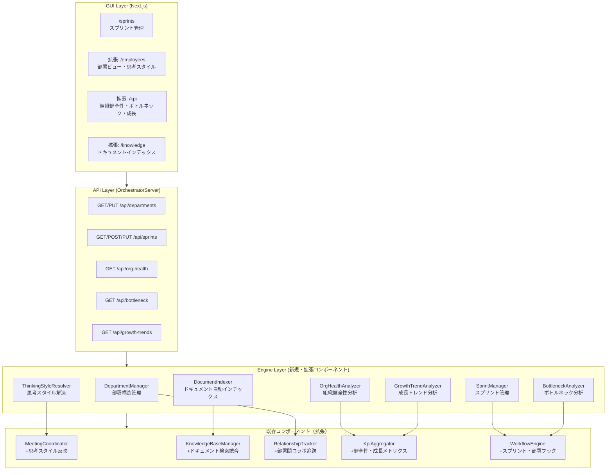

# Design Document: Company Realism（組織リアリズム強化）

## Overview

既存のReal Company Experienceの基盤の上に、5つの柱で組織のリアリティを強化する設計。既存コンポーネントを拡張する形で、破壊的変更を避けつつ新機能を追加する。

### 設計方針

1. **拡張ベース**: 既存の型・クラスにオプショナルフィールドを追加する形で拡張
2. **非侵襲的統合**: WorkflowEngine等への統合はtry/catchで囲み、新機能の障害が既存機能に影響しない
3. **ファイルベース永続化**: 全データは`runtime/state/`配下にJSON形式で保存
4. **YAML後方互換**: エージェント定義YAMLに新フィールドを追加するが、既存フィールドは変更しない

### 既存コンポーネントとの関係

| 既存コンポーネント | 本specでの拡張内容 |
|-------------------|-------------------|
| MeetingCoordinator | `generateParticipantOpinion`にThinking_Style反映ロジックを追加 |
| KnowledgeBaseManager | DocumentIndexerからの検索結果統合、source_typeフィールド追加 |
| RelationshipTracker | 部署間コラボレーション追跡の基盤として活用 |
| KpiAggregator | Organization_Health、ボトルネック分析、成長トレンドのデータソース |
| WorkflowEngine | スプリント管理フック、部署コラボレーション記録フックを追加 |
| Employee API | 部署情報、思考スタイル情報の統合 |

## Architecture

### システム全体図



### データフロー

```
ワークフロー実行
    │
    ├─→ DepartmentManager（部署間コラボレーション記録）
    ├─→ ThinkingStyleResolver → MeetingCoordinator（思考スタイル反映の意見生成）
    │
    ├─ スプリント内実行 ─→ SprintManager（進捗更新、ベロシティ計算）
    │
    ├─ ワークフロー完了 ─→ BottleneckAnalyzer（滞留分析）
    ├─ ワークフロー完了 ─→ GrowthTrendAnalyzer（成長メトリクス更新）
    │
    └─→ OrgHealthAnalyzer（組織健全性スコア更新）

定期イベント
    ├─ スプリント開始 ─→ SprintManager → Sprint_Planning会議
    ├─ スプリント終了 ─→ SprintManager → Sprint_Review会議
    └─ ドキュメント変更検出 ─→ DocumentIndexer（インデックス更新）
```

## Components and Interfaces

### 1. DepartmentManager（部署構造管理）

```typescript
// tools/cli/lib/execution/department-manager.ts

/** 部署定義 */
interface Department {
  id: string;
  name: string;
  description: string;
  headAgentId: string;
  memberAgentIds: string[];
}

/** 部署設定 */
interface DepartmentConfig {
  departments: Department[];
  updatedAt: string;
}

/** 部署間コラボレーション記録 */
interface DepartmentCollaboration {
  departmentIds: string[];
  workflowId: string;
  collaborationType: 'joint_review' | 'cross_department_task' | 'shared_meeting';
  timestamp: string;
}

/** 部署間コラボレーションスコア */
interface DepartmentCollaborationScore {
  departmentA: string;
  departmentB: string;
  score: number;          // 0-100
  interactionCount: number;
}

class DepartmentManager {
  constructor(basePath?: string)

  /** 部署設定を取得 */
  getConfig(): Promise<DepartmentConfig>

  /** 部署設定を更新 */
  updateConfig(config: DepartmentConfig): Promise<void>

  /** デフォルト部署設定を生成 */
  createDefaultConfig(): DepartmentConfig

  /** エージェントの所属部署を取得 */
  getDepartmentForAgent(agentId: string): Promise<Department | null>

  /** コラボレーションを記録 */
  recordCollaboration(collab: DepartmentCollaboration): Promise<void>

  /** コラボレーションスコアを計算（過去30日） */
  getCollaborationScores(): Promise<DepartmentCollaborationScore[]>

  /** 孤立部署アラートを検出 */
  checkIsolationAlerts(): Promise<{ departmentId: string; avgScore: number }[]>
}
```

デフォルト部署構成:

| 部署 | ID | 部署長 | メンバー |
|------|-----|--------|---------|
| 開発部 | development | coo_pm | reviewer, merger |
| 品質管理部 | quality_assurance | quality_authority | security_officer |
| 経営企画部 | corporate_planning | cfo | market_researcher |
| 人事部 | human_resources | hiring_manager | — |

### 2. ThinkingStyleResolver（思考スタイル解決）

```typescript
// tools/cli/lib/execution/thinking-style-resolver.ts

/** 思考スタイル */
type ThinkingStyleType = 'realist' | 'innovator' | 'cautious' | 'optimist' | 'analyst' | 'pragmatist';

/** 性格特性 */
interface PersonalityTrait {
  trait: string;       // e.g., 'collaborative', 'independent', 'detail_oriented'
  intensity: number;   // 1-5
}

/** エージェントの思考プロファイル */
interface ThinkingProfile {
  agentId: string;
  primaryStyle: ThinkingStyleType;
  secondaryStyle?: ThinkingStyleType;
  styleDescription: string;
  personalityTraits: PersonalityTrait[];
}

class ThinkingStyleResolver {
  /** エージェントの思考プロファイルを取得（YAML読み取り） */
  getProfile(agentId: string): Promise<ThinkingProfile>

  /** 全エージェントの思考プロファイルを取得 */
  getAllProfiles(): Promise<ThinkingProfile[]>

  /** デフォルトの思考プロファイルを取得（YAML未定義時） */
  getDefaultProfile(agentId: string): ThinkingProfile

  /** 思考スタイルに基づく意見生成プロンプトを構築 */
  buildOpinionPrompt(profile: ThinkingProfile, topic: string): string

  /** 会議参加者間の対立ポイントを検出 */
  detectConflicts(profiles: ThinkingProfile[]): { agentA: string; agentB: string; conflictType: string }[]
}
```

デフォルト思考スタイル割り当て:

| エージェント | Primary Style | Secondary Style | 主な特性 |
|-------------|--------------|----------------|---------|
| coo_pm | pragmatist | realist | collaborative, big_picture |
| quality_authority | cautious | analyst | detail_oriented, risk_averse |
| security_officer | cautious | realist | detail_oriented, independent |
| cfo | analyst | pragmatist | detail_oriented, risk_averse |
| hiring_manager | optimist | innovator | collaborative, big_picture |
| reviewer | analyst | cautious | detail_oriented, independent |
| merger | pragmatist | realist | collaborative, risk_averse |
| market_researcher | innovator | analyst | big_picture, risk_taker |

### 3. DocumentIndexer（ドキュメント自動インデックス）

```typescript
// tools/cli/lib/execution/document-indexer.ts

/** インデックスエントリ */
interface DocumentIndexEntry {
  filePath: string;
  title: string;
  category: 'policy' | 'spec' | 'architecture' | 'decision';
  lastModified: string;
  summary: string;
  tags: string[];
}

/** ドキュメントインデックス */
interface DocumentIndex {
  entries: DocumentIndexEntry[];
  lastIndexedAt: string;
}

class DocumentIndexer {
  constructor(basePath?: string)

  /** フルインデックスを実行 */
  buildIndex(): Promise<DocumentIndex>

  /** 増分インデックスを実行（変更ファイルのみ） */
  incrementalUpdate(): Promise<DocumentIndex>

  /** インデックスを検索 */
  search(query: string, category?: string): Promise<DocumentIndexEntry[]>

  /** 現在のインデックスを取得 */
  getIndex(): Promise<DocumentIndex>
}
```

スキャン対象ディレクトリとカテゴリマッピング:

| ディレクトリ | カテゴリ |
|-------------|---------|
| `docs/company/` | policy |
| `docs/specs/` | spec |
| `docs/architecture/` | architecture |
| `workflows/decisions/` | decision |

### 4. SprintManager（スプリント管理）

```typescript
// tools/cli/lib/execution/sprint-manager.ts

/** スプリントステータス */
type SprintStatus = 'planning' | 'active' | 'review' | 'completed';

/** スプリント */
interface Sprint {
  id: string;
  name: string;
  goal: string;
  startDate: string;
  endDate: string;
  status: SprintStatus;
  ticketIds: string[];
  completedTicketIds: string[];
  velocity: number;
  plannedVelocity: number;
  planningMeetingId?: string;
  reviewMeetingId?: string;
  createdAt: string;
  updatedAt: string;
}

/** スプリント作成入力 */
interface CreateSprintInput {
  name: string;
  goal: string;
  durationWeeks: 1 | 2;
  ticketIds: string[];
}

class SprintManager {
  constructor(basePath?: string)

  /** スプリントを作成 */
  createSprint(input: CreateSprintInput): Promise<Sprint>

  /** アクティブスプリントを取得 */
  getActiveSprint(): Promise<Sprint | null>

  /** スプリントを取得 */
  getSprint(id: string): Promise<Sprint | null>

  /** スプリント一覧を取得 */
  listSprints(filter?: { status?: SprintStatus }): Promise<Sprint[]>

  /** スプリントのステータスを更新 */
  updateStatus(id: string, status: SprintStatus): Promise<void>

  /** チケット完了を記録 */
  completeTicket(sprintId: string, ticketId: string): Promise<void>

  /** ベロシティを計算 */
  calculateVelocity(sprintId: string): Promise<number>

  /** ベロシティトレンドを取得 */
  getVelocityTrend(count?: number): Promise<{ sprintId: string; velocity: number }[]>

  /** スプリントを閉じる */
  closeSprint(id: string): Promise<Sprint>
}
```

### 5. OrgHealthAnalyzer（組織健全性分析）

```typescript
// tools/cli/lib/execution/org-health-analyzer.ts

/** 組織健全性スコア */
interface OrgHealthScore {
  overall: number;           // 0-100
  moodAverage: number;       // 0-100
  collaborationScore: number; // 0-100
  taskSuccessRate: number;   // 0-100
  knowledgeGrowthRate: number; // 0-100
  attritionRisk: 'low' | 'medium' | 'high';
  trend: 'improving' | 'stable' | 'declining';
  contributingFactors: { factor: string; impact: 'positive' | 'negative'; value: number }[];
  calculatedAt: string;
}

class OrgHealthAnalyzer {
  constructor(
    moodTracker: MoodTracker,
    departmentManager: DepartmentManager,
    performanceTracker: AgentPerformanceTracker,
    knowledgeBaseManager: KnowledgeBaseManager,
    basePath?: string
  )

  /** 組織健全性スコアを計算 */
  analyze(): Promise<OrgHealthScore>

  /** 健全性スコア履歴を取得 */
  getHistory(days?: number): Promise<OrgHealthScore[]>

  /** クリティカルアラートを検出 */
  checkCriticalAlerts(): Promise<{ type: string; message: string; severity: 'warning' | 'critical' }[]>
}
```

### 6. BottleneckAnalyzer（ボトルネック分析）

```typescript
// tools/cli/lib/execution/bottleneck-analyzer.ts

/** ボトルネック */
interface Bottleneck {
  location: string;          // エージェントID、部署ID、またはフェーズ名
  locationType: 'agent' | 'department' | 'phase';
  severity: 'high' | 'medium' | 'low';
  averageWaitTime: number;   // 分
  taskQueueDepth: number;
  suggestedActions: string[];
}

/** ボトルネック分析結果 */
interface BottleneckAnalysis {
  bottlenecks: Bottleneck[];
  analyzedAt: string;
  workflowsAnalyzed: number;
}

class BottleneckAnalyzer {
  constructor(basePath?: string)

  /** ボトルネック分析を実行 */
  analyze(workflowStates: WorkflowState[]): Promise<BottleneckAnalysis>

  /** 最新の分析結果を取得 */
  getLatest(): Promise<BottleneckAnalysis | null>

  /** 分析結果を永続化 */
  persist(analysis: BottleneckAnalysis): Promise<void>
}
```

### 7. GrowthTrendAnalyzer（成長トレンド分析）

```typescript
// tools/cli/lib/execution/growth-trend-analyzer.ts

/** 成長メトリクス */
interface GrowthMetrics {
  period: string;
  newSkillsAcquired: number;
  knowledgeEntriesAdded: number;
  averageQualityImprovement: number;
  sprintVelocity: number;
  departmentCapabilityScore: number;
}

/** 成長トレンド */
interface GrowthTrend {
  metrics: GrowthMetrics[];
  growthRates: { metric: string; rate: number }[];
  calculatedAt: string;
}

class GrowthTrendAnalyzer {
  constructor(
    performanceTracker: AgentPerformanceTracker,
    knowledgeBaseManager: KnowledgeBaseManager,
    sprintManager: SprintManager,
    basePath?: string
  )

  /** 成長トレンドを計算 */
  analyze(periodCount?: number): Promise<GrowthTrend>

  /** 成長トレンド履歴を取得 */
  getHistory(): Promise<GrowthTrend | null>
}
```

## Data Models

### 永続化ディレクトリ構造（新規追加分）

```
runtime/state/
├── departments/               # NEW: 部署管理
│   ├── config.json            #   DepartmentConfig
│   └── collaborations.json    #   DepartmentCollaboration[]
│
├── knowledge-base/
│   ├── document-index.json    # NEW: ドキュメントインデックス
│   ├── index.json             #   既存: ナレッジエントリインデックス
│   └── entries/               #   既存: ナレッジエントリ
│
├── sprints/                   # NEW: スプリント管理
│   └── <sprint-id>.json       #   Sprint
│
├── org-health/                # NEW: 組織健全性
│   └── <date>.json            #   OrgHealthScore
│
├── bottleneck/                # NEW: ボトルネック分析
│   └── latest.json            #   BottleneckAnalysis
│
└── growth-trends/             # NEW: 成長トレンド
    └── latest.json            #   GrowthTrend
```

### エージェント定義YAML拡張（後方互換）

```yaml
# agents/registry/quality_authority.yaml に追加するフィールド例

# 既存フィールドはそのまま維持
id: 'quality_authority'
title: 'Quality Authority (Governance)'
# ... 既存フィールド ...

# NEW: 思考スタイル（オプショナル）
thinking_style:
  primary: 'cautious'
  secondary: 'analyst'
  description: |
    品質リスクを最優先に考え、データに基づいた慎重な判断を行う。
    新しい提案に対しては潜在的な問題点を先に洗い出す傾向がある。

# NEW: 性格特性（オプショナル）
personality_traits:
  - trait: 'detail_oriented'
    intensity: 5
  - trait: 'risk_averse'
    intensity: 4
  - trait: 'independent'
    intensity: 3
```

### KnowledgeEntry拡張（後方互換）

```typescript
// 既存のKnowledgeEntryに source_type を追加
interface KnowledgeEntry {
  // ... 既存フィールド ...
  /** NEW: ナレッジの出所（オプショナル、後方互換） */
  source_type?: 'retrospective' | 'escalation' | 'quality_gate_failure'
    | 'document_index' | 'sprint_review' | 'manual';
}
```

### API エンドポイント一覧（新規）

| Method | Path | 説明 |
|--------|------|------|
| GET | `/api/departments` | 部署設定取得 |
| PUT | `/api/departments` | 部署設定更新 |
| GET | `/api/sprints` | スプリント一覧 |
| POST | `/api/sprints` | スプリント作成 |
| PUT | `/api/sprints/:id` | スプリント更新 |
| GET | `/api/org-health` | 組織健全性スコア |
| GET | `/api/bottleneck` | ボトルネック分析結果 |
| GET | `/api/growth-trends` | 成長トレンド |

### GUI画面一覧（新規・拡張）

| パス | 種別 | 内容 |
|------|------|------|
| `/sprints` | 新規 | スプリント管理（作成、進捗、ベロシティ） |
| `/employees` | 拡張 | 部署グループビュー、思考スタイル表示 |
| `/kpi` | 拡張 | 組織健全性、ボトルネックヒートマップ、成長トレンド |
| `/knowledge` | 拡張 | 社内ドキュメントタブ |


## Correctness Properties

*プロパティとは、システムの全ての有効な実行において成り立つべき特性や振る舞いのことである。プロパティは、人間が読める仕様と機械的に検証可能な正しさの保証を橋渡しする形式的な記述として機能する。*

### Property 1: DepartmentManager永続化ラウンドトリップ

*For any* valid DepartmentConfig（部署設定）およびDepartmentCollaboration（コラボレーション記録）、永続化してから読み込んだデータは元のデータと等価であること。

**Validates: Requirements 1.3, 2.2**

### Property 2: コラボレーションスコアの範囲と単調性

*For any* 部署ペアとコラボレーション記録の集合に対して、計算されるコラボレーションスコアは0以上100以下であること。また、インタラクション回数が増加した場合、スコアは減少しないこと。

**Validates: Requirements 2.4**

### Property 3: 部署孤立アラートの正確性

*For any* 部署設定において、ある部署の全他部署とのコラボレーションスコアが20未満の場合、かつその場合に限り、孤立アラートが生成されること。

**Validates: Requirements 2.5**

### Property 4: ThinkingProfile YAML解析ラウンドトリップ

*For any* 有効なThinkingProfile（思考スタイル: primary/secondary style、personality_traits）、YAML形式で書き出してから読み込んだプロファイルは元のプロファイルと等価であること。既存のYAMLフィールドが保持されること。

**Validates: Requirements 3.1, 3.2**

### Property 5: 思考スタイルに基づく意見プロンプトの一貫性

*For any* ThinkingProfileとトピックの組み合わせに対して、生成される意見プロンプトはそのエージェントのprimary styleに対応するキーワード（cautious→リスク/懸念、innovator→新しい/革新、analyst→データ/分析等）を含むこと。

**Validates: Requirements 4.1**

### Property 6: 会議参加者間の対立検出

*For any* 会議参加者セットにおいて、対立する思考スタイルのペア（innovator vs cautious、optimist vs analyst等）が存在する場合、対立ポイントが検出されること。対立するスタイルが存在しない場合、対立は検出されないこと。

**Validates: Requirements 4.2**

### Property 7: DocumentIndexerの抽出完全性

*For any* 対象ディレクトリ内のMarkdownファイルに対して、インデクサーはエントリを生成し、そのエントリにはファイルパス、タイトル（最初の見出しから抽出）、カテゴリ（ディレクトリに基づく）、最終更新日が含まれること。

**Validates: Requirements 5.1, 5.2**

### Property 8: DocumentIndexerの増分更新の正確性

*For any* インデックス済みファイル集合において、変更されていないファイルのエントリは更新されず、変更されたファイルのエントリのみが更新されること。新規ファイルは追加されること。

**Validates: Requirements 5.6**

### Property 9: ナレッジ検索のドキュメントインデックス統合

*For any* 検索クエリにおいて、ドキュメントインデックスにマッチするエントリが存在する場合、検索結果にそのエントリが含まれ、source_typeが"document_index"として区別されること。

**Validates: Requirements 5.4, 6.4**

### Property 10: 品質ゲート失敗時のナレッジ自動生成

*For any* 品質ゲート失敗を含むワークフロー完了に対して、KnowledgeBaseManagerにcategory="failure_case"かつsource_type="quality_gate_failure"のエントリが生成されること。

**Validates: Requirements 6.1**

### Property 11: スプリントライフサイクルの状態遷移

*For any* スプリントに対して、ステータス遷移はplanning→active→review→completedの順序に従うこと。逆方向や飛び越しの遷移は拒否されること。作成されたスプリントは全必須フィールド（id, name, goal, startDate, endDate, status, ticketIds, velocity）を持つこと。

**Validates: Requirements 7.1, 7.2**

### Property 12: スプリント永続化ラウンドトリップ

*For any* 有効なSprint、永続化してから読み込んだデータは元のデータと等価であること。

**Validates: Requirements 7.4**

### Property 13: スプリント作成時のプランニング会議トリガー

*For any* スプリント作成に対して、Sprint_Planning会議がトリガーされ、スプリントのplanningMeetingIdが設定されること。

**Validates: Requirements 8.1**

### Property 14: スプリント閉鎖時のレビュー会議トリガー

*For any* スプリント閉鎖に対して、Sprint_Review会議がトリガーされ、スプリントのreviewMeetingIdが設定されること。レビュー結果がRetrospectiveEngineに渡されること。

**Validates: Requirements 8.3, 8.5**

### Property 15: 組織健全性スコアの範囲と重み付け

*For any* 入力メトリクス（mood: 0-100, collaboration: 0-100, taskSuccess: 0-100, knowledgeGrowth: 0-100）に対して、Organization_Healthスコアは0以上100以下であること。スコアはmood*0.3 + collaboration*0.2 + taskSuccess*0.25 + knowledgeGrowth*0.25の重み付け計算に従うこと。

**Validates: Requirements 9.2**

### Property 16: 組織健全性クリティカルアラート

*For any* Organization_Healthスコアが50未満の場合、クリティカルアラートが生成されること。50以上の場合はクリティカルアラートが生成されないこと。

**Validates: Requirements 9.4**

### Property 17: ボトルネック分析の出力完全性

*For any* ワークフロー状態の集合に対して、BottleneckAnalyzerが生成する各ボトルネックはlocation, locationType, severity, averageWaitTime, suggestedActionsの全フィールドを持つこと。severityはhigh/medium/lowのいずれかであること。

**Validates: Requirements 10.1, 10.2**

### Property 18: 成長メトリクス計算と成長率

*For any* 2つの連続する期間のメトリクスに対して、成長率は(current - previous) / max(previous, 1) * 100で計算されること。各メトリクス値は0以上であること。

**Validates: Requirements 11.1, 11.3**

## Error Handling

### エラーハンドリング方針

全ての新規コンポーネントは以下のエラーハンドリング方針に従う：

1. **ファイルI/Oエラー**: `ENOENT`（ファイル未存在）はデフォルト値を返す。その他のI/Oエラーはラップして再スロー
2. **YAML解析エラー**: 新フィールド（thinking_style, personality_traits）が未定義の場合はデフォルト値を使用。既存フィールドの解析エラーは上位に伝播
3. **WorkflowEngine統合エラー**: 全ての新機能フック（部署コラボ記録、スプリント更新等）はtry/catchで囲み、失敗しても既存ワークフローを中断しない
4. **スコア計算エラー**: 入力データが不足している場合はデフォルトスコア（50）を返す
5. **API エラー**: 400（不正リクエスト）、404（リソース未存在）、500（内部エラー）を適切に返す

### コンポーネント別エラー処理

| コンポーネント | エラー種別 | 処理 |
|---------------|-----------|------|
| DepartmentManager | 設定ファイル未存在 | デフォルト設定を生成して返す |
| ThinkingStyleResolver | YAML未定義フィールド | デフォルトプロファイルを返す |
| DocumentIndexer | ファイル読み取り失敗 | 該当ファイルをスキップしてログ出力 |
| SprintManager | 不正な状態遷移 | エラーをスローして遷移を拒否 |
| OrgHealthAnalyzer | データソース取得失敗 | 該当メトリクスをデフォルト値（50）で計算 |
| BottleneckAnalyzer | ワークフローデータ不足 | 空の分析結果を返す |
| GrowthTrendAnalyzer | 前期データ未存在 | 成長率を0%として計算 |

## Testing Strategy

### テストフレームワーク

- **ユニットテスト**: Vitest
- **プロパティベーステスト**: fast-check
- **E2Eテスト**: Playwright（GUI画面のテスト）

### テストファイル構成

| テストファイル | 対象コンポーネント |
|---------------|-------------------|
| `tests/execution/department-manager.test.ts` | DepartmentManager |
| `tests/execution/department-manager.property.test.ts` | DepartmentManager（プロパティテスト） |
| `tests/execution/thinking-style-resolver.test.ts` | ThinkingStyleResolver |
| `tests/execution/thinking-style-resolver.property.test.ts` | ThinkingStyleResolver（プロパティテスト） |
| `tests/execution/document-indexer.test.ts` | DocumentIndexer |
| `tests/execution/document-indexer.property.test.ts` | DocumentIndexer（プロパティテスト） |
| `tests/execution/sprint-manager.test.ts` | SprintManager |
| `tests/execution/sprint-manager.property.test.ts` | SprintManager（プロパティテスト） |
| `tests/execution/org-health-analyzer.test.ts` | OrgHealthAnalyzer |
| `tests/execution/org-health-analyzer.property.test.ts` | OrgHealthAnalyzer（プロパティテスト） |
| `tests/execution/bottleneck-analyzer.test.ts` | BottleneckAnalyzer |
| `tests/execution/growth-trend-analyzer.test.ts` | GrowthTrendAnalyzer |

### テスト方針

**ユニットテスト**: 具体的な例、エッジケース、エラー条件に焦点
- デフォルト部署設定の正確性（Req 1.2）
- デフォルト思考スタイル割り当ての正確性（Req 3.3）
- スプリントプランニング会議の出力構造（Req 8.2）
- スプリントレビュー会議の出力構造（Req 8.4）
- API エンドポイントの存在確認（Req 1.5, 7.6, 10.5, 11.5）

**プロパティベーステスト**: 全入力に対して成り立つ普遍的性質
- 各プロパティテストは最低100イテレーション実行
- 各テストにはデザインドキュメントのプロパティ番号をコメントで参照
- タグ形式: `Feature: company-realism, Property {number}: {property_text}`
- 1つのCorrectnessプロパティにつき1つのプロパティベーステスト

**テストカバレッジ目標**: 80%以上
