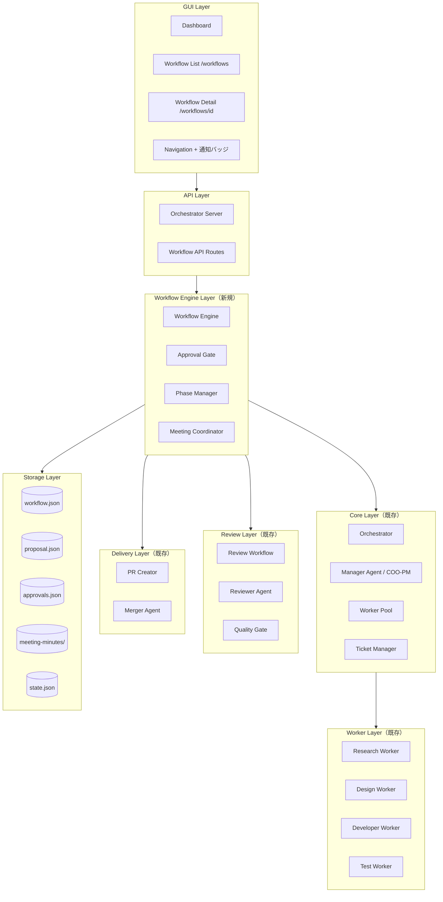
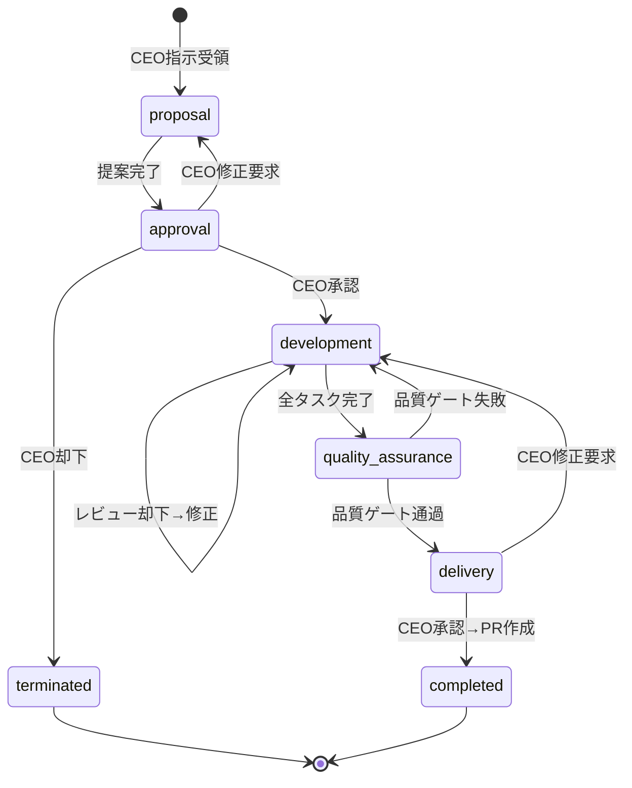
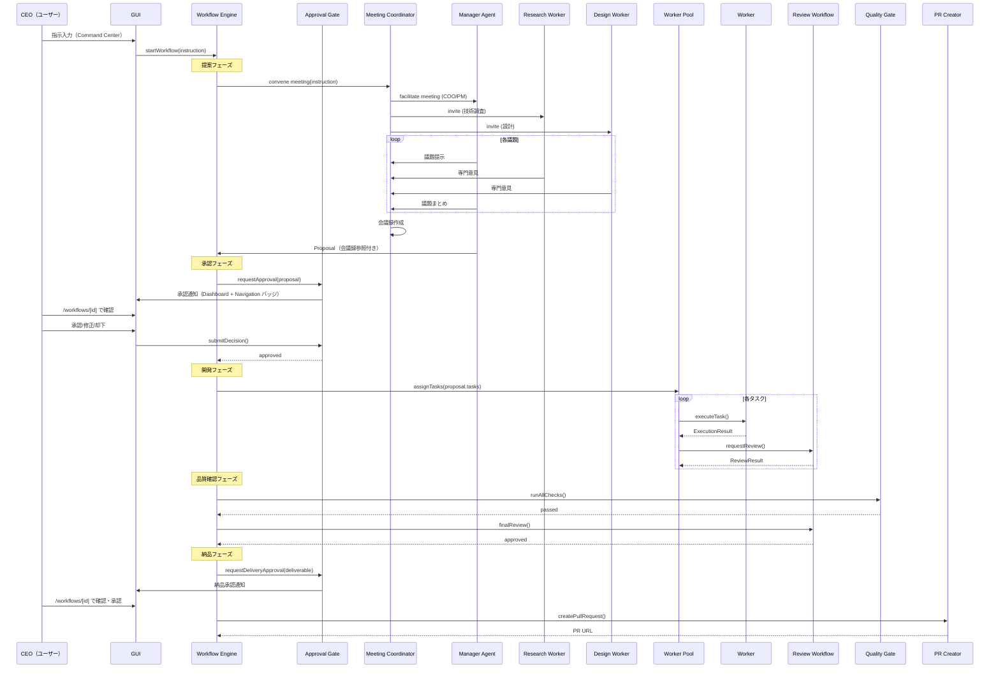

# Design Document: Company Workflow Engine

## Overview

本設計は、AIエージェントを「会社組織」として運用するためのワークフローエンジンを定義する。社長（ユーザー）の指示から、提案→承認→開発→品質確認→納品の5フェーズで構成される業務フローを実現する。

すべての操作・確認はGUIから行えることを前提とし、UI/UXを考慮した画面設計を含む。

### 設計目標

1. **会社組織としてのフェーズ管理**: 提案・承認・開発・品質確認・納品の5フェーズを順序制御する
2. **エージェント会議プロセス**: 提案フェーズで専門家エージェントが会議を行い、多角的な視点で計画を策定する
3. **社長の承認ゲート**: 提案後と納品時に社長（ユーザー）の承認を必須とする
4. **GUI完結操作**: すべての確認・操作をGUIから行える
5. **UI/UXデザイン**: 既存デザインシステムに準拠した直感的なインターフェース
6. **既存コンポーネントの活用**: Orchestrator、ManagerAgent、WorkerAgent、ReviewWorkflow等を統合する
7. **Orchestratorのバグ修正**: `startTaskProcessing`がワーカー完了を待たない問題を修正する

### 既存コンポーネントとの関係

| コンポーネント | 場所 | 本specでの扱い |
|---------------|------|---------------|
| Orchestrator | `tools/cli/lib/execution/orchestrator.ts` | 拡張（WorkflowEngine統合、startTaskProcessing修正） |
| ManagerAgent | `tools/cli/lib/execution/agents/manager.ts` | 活用（タスク分解・ワーカー管理） |
| WorkerAgent | `tools/cli/lib/execution/agents/worker.ts` | 活用（タスク実行） |
| ReviewWorkflow | `tools/cli/lib/execution/review-workflow.ts` | 活用（レビューフロー） |
| AgentBus | `tools/cli/lib/execution/agent-bus.ts` | 活用（エージェント間通信） |
| StateManager | `tools/cli/lib/execution/state-manager.ts` | 拡張（ワークフロー状態永続化） |
| OrchestratorServer | `tools/cli/lib/execution/orchestrator-server.ts` | 拡張（ワークフローAPI追加） |
| PRCreator | `tools/cli/lib/execution/pr-creator.ts` | 活用（PR作成） |
| TicketManager | `tools/cli/lib/execution/ticket-manager.ts` | 活用（チケット階層管理） |
| QualityGateIntegration | `tools/cli/lib/execution/quality-gate.ts` | 活用（品質ゲート実行） |

### 既存GUIコンポーネントの活用

| コンポーネント | 場所 | 用途 |
|---------------|------|------|
| Card | `gui/web/components/ui/Card.tsx` | カード表示（ワークフロー一覧、詳細セクション） |
| Badge | `gui/web/components/ui/Badge.tsx` | ステータスバッジ（フェーズ、ワーカー状態） |
| Tabs | `gui/web/components/ui/Tabs.tsx` | 詳細画面のタブ切り替え |
| Loading / Skeleton | `gui/web/components/ui/Loading.tsx` | ローディング状態 |
| Modal | `gui/web/components/ui/Modal.tsx` | 確認ダイアログ（ロールバック、abort） |
| Error / EmptyState | `gui/web/components/ui/Error.tsx` | エラー・空状態表示 |
| Navigation | `gui/web/components/layout/Navigation.tsx` | ナビゲーション（Workflows追加） |
| Header | `gui/web/components/layout/Header.tsx` | ヘッダー（通知バッジ追加） |

## Architecture

### システム構成図



### ワークフロー状態遷移図



### E2Eワークフロー図



## Components and Interfaces

### 1. WorkflowEngine（新規）

ワークフローのフェーズ管理と状態遷移を制御する中核コンポーネント。

```typescript
/**
 * ワークフローフェーズ
 * @see Requirement 1.1
 */
type WorkflowPhase = 'proposal' | 'approval' | 'development' | 'quality_assurance' | 'delivery';

/**
 * ワークフロー状態
 */
type WorkflowStatus = 'running' | 'waiting_approval' | 'completed' | 'terminated' | 'failed';

/**
 * フェーズ遷移イベント
 * @see Requirement 1.2
 */
interface PhaseTransition {
  from: WorkflowPhase;
  to: WorkflowPhase;
  timestamp: string;
  reason: string;
}

/**
 * ワークフロー状態
 * @see Requirement 1.3, 13.3
 */
interface WorkflowState {
  workflowId: string;
  runId: string;
  projectId: string;
  instruction: string;
  currentPhase: WorkflowPhase;
  status: WorkflowStatus;
  phaseHistory: PhaseTransition[];
  approvalDecisions: ApprovalDecision[];
  workerAssignments: Record<string, string>;
  errorLog: ErrorLogEntry[];
  proposal?: Proposal;
  deliverable?: Deliverable;
  meetingMinutesIds: string[];
  escalation?: WorkflowEscalation;
  progress?: WorkflowProgress;
  qualityResults?: QualityResults;
  createdAt: string;
  updatedAt: string;
}

/**
 * 開発進捗情報（GUI Progress タブ用）
 * @see Requirement 9.5, 9.6
 */
interface WorkflowProgress {
  totalTasks: number;
  completedTasks: number;
  failedTasks: number;
  subtasks: SubtaskProgress[];
}

interface SubtaskProgress {
  id: string;
  title: string;
  status: 'pending' | 'working' | 'review' | 'completed' | 'failed' | 'skipped';
  workerType: WorkerType;
  assignedWorkerId?: string;
  startedAt?: string;
  completedAt?: string;
  reviewStatus?: 'pending' | 'approved' | 'rejected';
}

/**
 * 品質結果情報（GUI Quality タブ用）
 * @see Requirement 9.7
 */
interface QualityResults {
  lintResult?: { passed: boolean; errorCount: number; warningCount: number; details: string };
  testResult?: { passed: boolean; total: number; passed_count: number; failed_count: number; coverage: number };
  finalReviewResult?: { passed: boolean; reviewer: string; feedback: string };
}

/**
 * ワークフローエンジンインターフェース
 * @see Requirements: 1.1-1.5
 */
interface IWorkflowEngine {
  /** ワークフローを開始 */
  startWorkflow(instruction: string, projectId: string): Promise<string>;
  
  /** 現在のワークフロー状態を取得 */
  getWorkflowState(workflowId: string): Promise<WorkflowState | null>;
  
  /** 全ワークフロー一覧を取得 */
  listWorkflows(filter?: { status?: WorkflowStatus }): Promise<WorkflowState[]>;
  
  /** フェーズをロールバック */
  rollbackToPhase(workflowId: string, targetPhase: WorkflowPhase): Promise<void>;
  
  /** ワークフローを終了 */
  terminateWorkflow(workflowId: string, reason: string): Promise<void>;
  
  /** 開発進捗を取得 */
  getProgress(workflowId: string): Promise<WorkflowProgress>;
  
  /** 品質結果を取得 */
  getQualityResults(workflowId: string): Promise<QualityResults>;
}
```

ファイル配置: `tools/cli/lib/execution/workflow-engine.ts`

### 2. MeetingCoordinator（新規）

エージェント間の会議を調整し、会議録を生成するコンポーネント。提案フェーズでCOO/PMが専門家を招集し、議題ごとに意見を収集して合意形成を行う。

```typescript
/**
 * 会議参加者
 * @see Requirement 2.2
 */
interface MeetingParticipant {
  agentId: string;
  role: string;
  workerType: WorkerType;
  expertise: string[];
}

/**
 * 議題
 * @see Requirement 12.1
 */
interface AgendaItem {
  id: string;
  topic: string;
  description: string;
  status: 'pending' | 'discussing' | 'concluded';
  summary?: string;
}

/**
 * 会議発言
 * @see Requirement 12.2
 */
interface MeetingStatement {
  participantId: string;
  participantRole: string;
  content: string;
  agendaItemId: string;
  timestamp: string;
}

/**
 * 決定事項
 */
interface MeetingDecision {
  agendaItemId: string;
  decision: string;
  rationale: string;
}

/**
 * アクションアイテム
 */
interface ActionItem {
  description: string;
  assignee: string;
  workerType: WorkerType;
  priority: 'low' | 'medium' | 'high';
}

/**
 * 会議録
 * @see Requirement 2.8
 */
interface MeetingMinutes {
  meetingId: string;
  workflowId: string;
  agenda: AgendaItem[];
  participants: MeetingParticipant[];
  statements: MeetingStatement[];
  decisions: MeetingDecision[];
  actionItems: ActionItem[];
  facilitator: string;
  startedAt: string;
  endedAt: string;
}

/**
 * 会議調整インターフェース
 * @see Requirements: 2.1-2.11, 12.1-12.7
 */
interface IMeetingCoordinator {
  /** 会議を開催 */
  conveneMeeting(
    workflowId: string,
    instruction: string,
    facilitatorId: string
  ): Promise<MeetingMinutes>;

  /** 会議に参加者を追加 */
  addParticipant(meetingId: string, participant: MeetingParticipant): void;

  /** 議題を追加 */
  addAgendaItem(meetingId: string, item: AgendaItem): void;

  /** 会議録を取得 */
  getMeetingMinutes(meetingId: string): MeetingMinutes | null;

  /** ワークフローの全会議録を取得 */
  getMeetingMinutesForWorkflow(workflowId: string): MeetingMinutes[];

  /** 会議録を永続化 */
  saveMeetingMinutes(minutes: MeetingMinutes): Promise<void>;
}
```

ファイル配置: `tools/cli/lib/execution/meeting-coordinator.ts`

### 3. ApprovalGate（新規）

社長の承認を待つゲート機能。

```typescript
/**
 * 承認アクション
 * @see Requirement 3.2
 */
type ApprovalAction = 'approve' | 'request_revision' | 'reject';

/**
 * 承認決定
 * @see Requirement 3.6
 */
interface ApprovalDecision {
  workflowId: string;
  phase: WorkflowPhase;
  action: ApprovalAction;
  feedback?: string;
  decidedAt: string;
}

/**
 * 承認待ちアイテム
 */
interface PendingApproval {
  workflowId: string;
  phase: WorkflowPhase;
  content: Proposal | Deliverable;
  createdAt: string;
}

/**
 * 承認ゲートインターフェース
 * @see Requirements: 3.1-3.7
 */
interface IApprovalGate {
  /** 承認を要求（ワーカー実行を一時停止） */
  requestApproval(workflowId: string, phase: WorkflowPhase, content: Proposal | Deliverable): Promise<void>;
  
  /** CEO決定を送信 */
  submitDecision(workflowId: string, decision: ApprovalDecision): Promise<void>;
  
  /** 承認待ちアイテム一覧を取得 */
  getPendingApprovals(): PendingApproval[];
  
  /** 承認履歴を取得 */
  getApprovalHistory(workflowId: string): ApprovalDecision[];
  
  /** 承認待ち状態かどうか */
  isWaitingApproval(workflowId: string): boolean;
}
```

ファイル配置: `tools/cli/lib/execution/approval-gate.ts`

### 4. Proposal（データ構造）

COO/PMが会議結果を基に作成するプロジェクト計画書。

```typescript
/**
 * 提案書
 * @see Requirement 2.9, 2.10
 */
interface Proposal {
  workflowId: string;
  summary: string;
  scope: string;
  taskBreakdown: ProposalTask[];
  workerAssignments: ProposalWorkerAssignment[];
  riskAssessment: RiskItem[];
  dependencies: Dependency[];
  meetingMinutesIds: string[];
  createdAt: string;
}

interface ProposalTask {
  id: string;
  title: string;
  description: string;
  workerType: WorkerType;
  estimatedEffort: string;
  dependencies: string[];
}

interface ProposalWorkerAssignment {
  taskId: string;
  workerType: WorkerType;
  rationale: string;
}

interface RiskItem {
  description: string;
  severity: 'low' | 'medium' | 'high';
  mitigation: string;
}

interface Dependency {
  from: string;
  to: string;
  type: 'blocks' | 'requires';
}
```

### 5. Deliverable（データ構造）

納品フェーズで社長に提示する成果物一式。

```typescript
/**
 * 納品物
 * @see Requirement 6.1
 */
interface Deliverable {
  workflowId: string;
  summaryReport: string;
  changes: ChangeEntry[];
  testResults: TestResultSummary;
  reviewHistory: ReviewLogEntry[];
  artifacts: string[];
  createdAt: string;
}
```

### 6. EscalationManager（新規）

エスカレーション管理。

```typescript
/**
 * エスカレーションアクション
 * @see Requirement 14.2
 */
type EscalationAction = 'retry' | 'skip' | 'abort';

/**
 * エスカレーション
 * @see Requirements: 14.1-14.5
 */
interface WorkflowEscalation {
  workflowId: string;
  ticketId: string;
  failureDetails: string;
  workerType: WorkerType;
  retryCount: number;
  createdAt: string;
}

/**
 * エスカレーション決定
 */
interface EscalationDecision {
  action: EscalationAction;
  parameters?: Record<string, unknown>;
  reason?: string;
}
```

### 7. Orchestrator.startTaskProcessing 修正

```typescript
/**
 * 修正後のstartTaskProcessing
 * @see Requirement 7.1-7.3
 * 
 * 変更点:
 * - assignSubTasksToWorkersの戻り値をPromise<ExecutionResult[]>に変更
 * - 全ワーカーのExecutionResult完了をawaitしてからfinalizeTaskExecutionを呼ぶ
 * - 失敗したワーカーの結果をExecutionStateに記録する
 */
private async startTaskProcessing(
  task: Task,
  autoDecompose: boolean,
  preGeneratedRunId?: RunId
): Promise<void> {
  // ... 既存の初期化処理 ...

  if (autoDecompose) {
    const subTasks = await this.managerAgent.decomposeTask(task);
    task.subTasks = subTasks;
    task.status = 'executing';
    
    this.managerAgent.startProgressMonitoring(runId);

    // 修正: ワーカーの実行完了をawaitする
    const results = await this.assignSubTasksToWorkers(subTasks, runId, task.projectId);
    
    // 結果をExecutionStateに反映
    for (const result of results) {
      executionState.artifacts.push(...result.artifacts);
      if (result.status === 'error' || result.status === 'quality_failed') {
        executionState.status = 'failed';
      }
    }
  }

  // ワーカー完了後に後処理を実行
  await this.finalizeTaskExecution(task, runId, executionState, startTime);
}
```

### 8. OrchestratorServer拡張（ワークフローAPI）

```typescript
/**
 * 追加エンドポイント
 * @see Requirement 15.1-15.11
 */

// POST /api/workflows - ワークフロー開始
interface StartWorkflowRequest {
  instruction: string;
  projectId: string;
}

// GET /api/workflows - ワークフロー一覧（status フィルタ対応）
// GET /api/workflows/:id - ワークフロー状態取得（全データ含む）

// POST /api/workflows/:id/approve - CEO承認決定送信
interface ApproveWorkflowRequest {
  action: ApprovalAction;
  feedback?: string;
}

// GET /api/workflows/:id/proposal - 提案書取得
// GET /api/workflows/:id/deliverable - 納品物取得
// GET /api/workflows/:id/meetings - 会議録一覧取得
// GET /api/workflows/:id/progress - 開発進捗取得
// GET /api/workflows/:id/quality - 品質結果取得

// POST /api/workflows/:id/escalation - エスカレーション決定送信
interface EscalationRequest {
  action: EscalationAction;
  parameters?: Record<string, unknown>;
  reason?: string;
}

// POST /api/workflows/:id/rollback - フェーズロールバック
interface RollbackRequest {
  targetPhase: WorkflowPhase;
}
```

## GUI Design

### 画面構成

```
/workflows              → ワークフロー一覧画面
/workflows/[id]         → ワークフロー詳細画面（タブUI）
/dashboard              → ダッシュボード（承認通知統合）
Navigation              → Workflows リンク + 通知バッジ
```

### 9. ワークフロー一覧画面（/workflows）

社長が全ワークフローを俯瞰する画面。

```
┌─────────────────────────────────────────────────────────────┐
│ ワークフロー                                    [フィルタ ▼] │
│ 組織の業務フローを管理します                                  │
├─────────────────────────────────────────────────────────────┤
│                                                             │
│ ┌─────────────────────────────────────────────────────────┐ │
│ │ 🔴 承認待ち  WF-001                          2分前     │ │
│ │ 「ユーザー認証機能を実装してください」                     │ │
│ │                                                         │ │
│ │ ○ 提案 ─── ● 承認 ─── ○ 開発 ─── ○ 品質 ─── ○ 納品   │ │
│ │                                                         │ │
│ │ プロジェクト: my-app    [承認する →]                      │ │
│ └─────────────────────────────────────────────────────────┘ │
│                                                             │
│ ┌─────────────────────────────────────────────────────────┐ │
│ │ 🔵 実行中  WF-002                            15分前    │ │
│ │ 「決済システムのリファクタリング」                         │ │
│ │                                                         │ │
│ │ ✓ 提案 ─── ✓ 承認 ─── ● 開発 ─── ○ 品質 ─── ○ 納品   │ │
│ │                                                         │ │
│ │ プロジェクト: payment   進捗: 2/5 タスク完了              │ │
│ └─────────────────────────────────────────────────────────┘ │
│                                                             │
│ ┌─────────────────────────────────────────────────────────┐ │
│ │ ✅ 完了  WF-003                               1時間前   │ │
│ │ 「READMEの更新」                                        │ │
│ │                                                         │ │
│ │ ✓ 提案 ─── ✓ 承認 ─── ✓ 開発 ─── ✓ 品質 ─── ✓ 納品   │ │
│ │                                                         │ │
│ │ プロジェクト: docs      PR: #42                          │ │
│ └─────────────────────────────────────────────────────────┘ │
└─────────────────────────────────────────────────────────────┘
```

コンポーネント構成:
- `gui/web/app/workflows/page.tsx` - ワークフロー一覧ページ
- `gui/web/components/workflows/WorkflowCard.tsx` - ワークフローカード
- `gui/web/components/workflows/PhaseProgress.tsx` - フェーズ進行インジケーター（共通）
- `gui/web/components/workflows/WorkflowFilter.tsx` - フィルタ・ソート

```typescript
/**
 * PhaseProgress コンポーネント
 * 5フェーズの進行状況を水平ステッパーで表示
 * @see Requirement 16.2-16.5
 */
interface PhaseProgressProps {
  currentPhase: WorkflowPhase;
  status: WorkflowStatus;
  phaseHistory: PhaseTransition[];
  /** コンパクト表示（一覧カード用） */
  compact?: boolean;
}

// フェーズごとの表示状態:
// - completed: status-pass (#22c55e) + チェックマークアイコン
// - active: accent-primary (#3b82f6) + パルスアニメーション
// - pending: text-muted (#64748b) + 空円アイコン
// - failed: status-fail (#ef4444) + エラーアイコン
// フェーズ間は線で接続し、完了済みは実線、未完了は点線
```

### 10. ワークフロー詳細画面（/workflows/[id]）

社長がワークフローのすべてを確認・操作する中心画面。

```
┌─────────────────────────────────────────────────────────────┐
│ ← ワークフロー一覧    WF-001                                │
│ 「ユーザー認証機能を実装してください」                         │
│                                                             │
│ ┌─────────────────────────────────────────────────────────┐ │
│ │ ✓ 提案 ──── ● 承認 ──── ○ 開発 ──── ○ 品質 ──── ○ 納品│ │
│ └─────────────────────────────────────────────────────────┘ │
│                                                             │
│ ┌─── 承認が必要です ─────────────────────────────────────┐  │
│ │ COO/PMからの提案書が届いています。                       │  │
│ │ 内容を確認して判断してください。                          │  │
│ │                                                         │  │
│ │ [提案内容を表示...]                                      │  │
│ │                                                         │  │
│ │ フィードバック: [                                    ]   │  │
│ │                                                         │  │
│ │ [✓ 承認]  [↩ 修正要求]  [✕ 却下]                       │  │
│ └─────────────────────────────────────────────────────────┘  │
│                                                             │
│ [概要] [提案書] [会議録] [進捗] [品質] [承認履歴]           │
│ ─────────────────────────────────────────────────────────── │
│                                                             │
│ （選択中タブの内容）                                         │
│                                                             │
└─────────────────────────────────────────────────────────────┘
```

コンポーネント構成:
- `gui/web/app/workflows/[id]/page.tsx` - 詳細ページ（タブコンテナ）
- `gui/web/components/workflows/ApprovalPanel.tsx` - 承認アクションパネル
- `gui/web/components/workflows/OverviewTab.tsx` - 概要タブ
- `gui/web/components/workflows/ProposalTab.tsx` - 提案書タブ
- `gui/web/components/workflows/MeetingsTab.tsx` - 会議録タブ
- `gui/web/components/workflows/ProgressTab.tsx` - 進捗タブ
- `gui/web/components/workflows/QualityTab.tsx` - 品質タブ
- `gui/web/components/workflows/ApprovalsTab.tsx` - 承認履歴タブ
- `gui/web/components/workflows/EscalationAlert.tsx` - エスカレーションアラート
- `gui/web/components/workflows/RollbackDialog.tsx` - ロールバック確認ダイアログ

#### 10a. 概要タブ（OverviewTab）

```
┌─────────────────────────────────────────────────────────────┐
│ 概要                                                        │
├─────────────────────────────────────────────────────────────┤
│                                                             │
│ 指示内容                                                    │
│ ┌─────────────────────────────────────────────────────────┐ │
│ │ ユーザー認証機能を実装してください。ログイン、ログアウト、│ │
│ │ パスワードリセットの機能が必要です。                      │ │
│ └─────────────────────────────────────────────────────────┘ │
│                                                             │
│ メタデータ                                                  │
│ ┌──────────────┬──────────────┬──────────────┐             │
│ │ ワークフローID│ プロジェクト  │ 作成日時      │             │
│ │ WF-001       │ my-app       │ 2026/02/11   │             │
│ └──────────────┴──────────────┴──────────────┘             │
│                                                             │
│ フェーズ遷移タイムライン                                     │
│ ┌─────────────────────────────────────────────────────────┐ │
│ │ 10:00  提案フェーズ開始                                  │ │
│ │ 10:05  提案フェーズ完了 → 承認フェーズへ                  │ │
│ │ 10:12  CEO承認 → 開発フェーズへ                          │ │
│ │ ...                                                     │ │
│ └─────────────────────────────────────────────────────────┘ │
│                                                             │
│ [フェーズをロールバック]                                      │
└─────────────────────────────────────────────────────────────┘
```

#### 10b. 提案書タブ（ProposalTab）

```
┌─────────────────────────────────────────────────────────────┐
│ 提案書                                          v1 / v2 ▼  │
├─────────────────────────────────────────────────────────────┤
│                                                             │
│ サマリー                                                    │
│ ユーザー認証機能の実装。JWT認証、セッション管理、            │
│ パスワードリセットフローを含む。                              │
│                                                             │
│ スコープ                                                    │
│ バックエンドAPI + フロントエンドUI + テスト                   │
│                                                             │
│ タスク分解                                                  │
│ ┌────┬──────────────────┬──────────┬──────────┬──────────┐ │
│ │ #  │ タスク            │ 担当      │ 工数     │ 依存     │ │
│ ├────┼──────────────────┼──────────┼──────────┼──────────┤ │
│ │ 1  │ DB設計            │ Designer │ 2h      │ -        │ │
│ │ 2  │ API実装           │ Developer│ 4h      │ 1        │ │
│ │ 3  │ UI実装            │ Developer│ 3h      │ 1        │ │
│ │ 4  │ テスト作成        │ Tester   │ 2h      │ 2,3      │ │
│ └────┴──────────────────┴──────────┴──────────┴──────────┘ │
│                                                             │
│ リスク評価                                                  │
│ ┌──────────────────────────────┬──────┬──────────────────┐ │
│ │ リスク                       │ 重要度│ 対策             │ │
│ ├──────────────────────────────┼──────┼──────────────────┤ │
│ │ JWT秘密鍵の管理              │ 高   │ 環境変数で管理   │ │
│ └──────────────────────────────┴──────┴──────────────────┘ │
│                                                             │
│ 参照会議録: [会議 #mtg-001]                                  │
└─────────────────────────────────────────────────────────────┘
```

#### 10c. 会議録タブ（MeetingsTab）

チャット風タイムラインで会議の議論過程を表示。

```
┌─────────────────────────────────────────────────────────────┐
│ 会議録                                                      │
├─────────────────────────────────────────────────────────────┤
│                                                             │
│ ▼ 会議 #mtg-001  2026/02/11 10:00                          │
│   参加者: 👔 COO/PM  🔬 Research  🎨 Design                │
│   議題: 3件  決定事項: 2件                                   │
│                                                             │
│   ── 議題1: 認証方式の選定 ──                                │
│                                                             │
│   👔 COO/PM (ファシリテーター)                               │
│   ┌─────────────────────────────────────────────────────┐   │
│   │ 本プロジェクトの認証方式について議論します。           │   │
│   │ JWT vs セッション、どちらが適切でしょうか。            │   │
│   └─────────────────────────────────────────────────────┘   │
│                                                             │
│   🔬 Research Worker                                        │
│   ┌─────────────────────────────────────────────────────┐   │
│   │ JWTはステートレスでスケーラビリティに優れます。        │   │
│   │ ただしトークン無効化にはブラックリスト管理が必要です。 │   │
│   └─────────────────────────────────────────────────────┘   │
│                                                             │
│   🎨 Design Worker                                          │
│   ┌─────────────────────────────────────────────────────┐   │
│   │ UX観点では、リフレッシュトークンによるシームレスな     │   │
│   │ セッション維持が重要です。                             │   │
│   └─────────────────────────────────────────────────────┘   │
│                                                             │
│   👔 COO/PM (まとめ)                                        │
│   ┌─ bg-accent-primary/10 ──────────────────────────────┐   │
│   │ 決定: JWT + リフレッシュトークン方式を採用。           │   │
│   │ ブラックリスト管理はRedisで実装する。                  │   │
│   └─────────────────────────────────────────────────────┘   │
│                                                             │
│   ── 議題2: ... ──                                          │
│                                                             │
│ ▶ 会議 #mtg-002  2026/02/11 10:30（修正要求後の再会議）     │
└─────────────────────────────────────────────────────────────┘
```

UI設計ポイント:
- ファシリテーター（COO/PM）の発言は `bg-accent-primary/10` 背景で区別
- 各参加者にはロールアイコン（👔🔬🎨💻🧪）を表示
- まとめ・決定事項は異なる背景色で視覚的に強調
- 会議はアコーディオンで展開/折りたたみ

#### 10d. 進捗タブ（ProgressTab）

開発フェーズ中のリアルタイム進捗をKanban風に表示。

```
┌─────────────────────────────────────────────────────────────┐
│ 進捗                                    完了: 2/5 (40%)     │
│ ┌─────────────────────────────────────────────────────────┐ │
│ │ ████████░░░░░░░░░░░░                              40%  │ │
│ └─────────────────────────────────────────────────────────┘ │
├─────────────────────────────────────────────────────────────┤
│                                                             │
│  待機中        作業中         レビュー       完了     失敗  │
│ ┌────────┐  ┌────────────┐  ┌──────────┐  ┌──────┐  ┌──┐  │
│ │ #4     │  │ #3         │  │ #2       │  │ #1   │  │  │  │
│ │テスト  │  │ UI実装     │  │ API実装  │  │DB設計│  │  │  │
│ │🧪Tester│  │ 💻Developer│  │💻Developer│  │🎨    │  │  │  │
│ │        │  │ 作業中...  │  │レビュー中│  │ ✓    │  │  │  │
│ └────────┘  └────────────┘  └──────────┘  └──────┘  └──┘  │
│                                                             │
│ ワーカー状態                                                │
│ ┌─────────────────────────────────────────────────────────┐ │
│ │ 💻 Developer-1  作業中  #3 UI実装        開始: 10:15   │ │
│ │ 💻 Developer-2  レビュー待ち  #2 API実装  開始: 10:05   │ │
│ │ 🧪 Tester-1     待機中                                 │ │
│ └─────────────────────────────────────────────────────────┘ │
└─────────────────────────────────────────────────────────────┘
```

UI設計ポイント:
- Kanban列は `pending` `working` `review` `completed` `failed` の5列
- 各カードにはタスク番号、タイトル、ワーカータイプアイコン、ステータス
- `working` 列のカードには `accent-primary` のパルスボーダー
- `completed` 列は `status-pass` 背景
- `failed` 列は `status-fail` 背景
- 進捗バーは全体の完了率を表示
- ワーカー状態セクションで各ワーカーの現在の活動を表示
- 3秒間隔で自動リフレッシュ

#### 10e. 品質タブ（QualityTab）

品質ゲート結果を一覧表示。

```
┌─────────────────────────────────────────────────────────────┐
│ 品質チェック結果                                             │
├─────────────────────────────────────────────────────────────┤
│                                                             │
│ Lint                                              ✅ PASS   │
│ ┌─────────────────────────────────────────────────────────┐ │
│ │ エラー: 0  警告: 2                                      │ │
│ │ 詳細: src/auth.ts:15 - no-console warning               │ │
│ │       src/auth.ts:42 - no-console warning               │ │
│ └─────────────────────────────────────────────────────────┘ │
│                                                             │
│ テスト                                            ✅ PASS   │
│ ┌─────────────────────────────────────────────────────────┐ │
│ │ 合計: 24  成功: 24  失敗: 0                             │ │
│ │ カバレッジ: 85.2%                                       │ │
│ │ ┌─────────────────────────────────────────────────────┐ │ │
│ │ │ ████████████████████░░░░                     85.2% │ │ │
│ │ └─────────────────────────────────────────────────────┘ │ │
│ └─────────────────────────────────────────────────────────┘ │
│                                                             │
│ 最終レビュー                                      ✅ PASS   │
│ ┌─────────────────────────────────────────────────────────┐ │
│ │ レビュアー: Reviewer Agent                              │ │
│ │ フィードバック: コード品質は良好。命名規則も統一されて   │ │
│ │ います。マージ可能です。                                 │ │
│ └─────────────────────────────────────────────────────────┘ │
│                                                             │
│ ※品質確認フェーズ完了後に結果が表示されます                   │
└─────────────────────────────────────────────────────────────┘
```

#### 10f. 承認履歴タブ（ApprovalsTab）

```
┌─────────────────────────────────────────────────────────────┐
│ 承認履歴                                                    │
├─────────────────────────────────────────────────────────────┤
│                                                             │
│ ┌─────────────────────────────────────────────────────────┐ │
│ │ ✅ 承認  納品フェーズ                    2026/02/11 11:00│ │
│ │ フィードバック: 問題なし。マージしてください。            │ │
│ └─────────────────────────────────────────────────────────┘ │
│                                                             │
│ ┌─────────────────────────────────────────────────────────┐ │
│ │ ↩ 修正要求  承認フェーズ                 2026/02/11 10:15│ │
│ │ フィードバック: パスワードリセットのフローが不明確。      │ │
│ │ メール送信後の画面遷移を明確にしてください。              │ │
│ └─────────────────────────────────────────────────────────┘ │
│                                                             │
│ ┌─────────────────────────────────────────────────────────┐ │
│ │ ✅ 承認  承認フェーズ                    2026/02/11 10:30│ │
│ │ フィードバック: 修正内容を確認。承認します。              │ │
│ └─────────────────────────────────────────────────────────┘ │
└─────────────────────────────────────────────────────────────┘
```

#### 10g. エスカレーションアラート（EscalationAlert）

ワーカー失敗時に詳細画面上部に表示されるアラートパネル。

```
┌─── ⚠️ エスカレーション ──────────────────────────────────────┐
│                                                             │
│ タスク #3「UI実装」でワーカーが失敗しました。                 │
│                                                             │
│ ワーカータイプ: Developer                                    │
│ リトライ回数: 3/3（最大到達）                                │
│ エラー: TypeError: Cannot read property 'map' of undefined  │
│                                                             │
│ 対応を選択してください:                                      │
│                                                             │
│ [🔄 リトライ]  [⏭ スキップ]  [🛑 中止]                     │
│                                                             │
│ リトライパラメータ（オプション）:                             │
│ ワーカータイプ: [Developer ▼]                                │
│ 追加指示: [                                              ]   │
└─────────────────────────────────────────────────────────────┘
```

UI設計ポイント:
- `status-fail` カラーのボーダーと背景（`bg-status-fail/5 border-status-fail/30`）
- ⚠️ アイコンにパルスアニメーション
- 承認パネルの上に表示（最優先）

#### 10h. ロールバック確認ダイアログ（RollbackDialog）

```
┌─── フェーズロールバック ─────────────────────────────────────┐
│                                                             │
│ 現在のフェーズ「開発」から「提案」にロールバックします。      │
│                                                             │
│ ⚠️ 以下の影響があります:                                    │
│ - 開発フェーズの進捗がリセットされます                       │
│ - 承認フェーズの決定が無効になります                         │
│ - ワーカーの作業結果は保持されます（ログとして）             │
│                                                             │
│ ロールバック先: [提案 ▼]                                     │
│                                                             │
│                          [キャンセル]  [ロールバック実行]     │
└─────────────────────────────────────────────────────────────┘
```

### 11. ダッシュボード統合

既存の Dashboard ページに承認通知とワークフローサマリーを追加。

```
┌─────────────────────────────────────────────────────────────┐
│ ダッシュボード                                               │
├─────────────────────────────────────────────────────────────┤
│                                                             │
│ ┌─── 🔔 承認が必要です ─────────────────────────────────┐  │
│ │                                                       │  │
│ │ WF-001「ユーザー認証機能」の提案書が承認待ちです。     │  │
│ │ 2分前に提出されました。                                │  │
│ │                                                       │  │
│ │                              [確認する →]              │  │
│ └───────────────────────────────────────────────────────┘  │
│                                                             │
│ ワークフローサマリー                                         │
│ ┌──────────┬──────────┬──────────┬──────────┐             │
│ │ 🔵 実行中 │ 🟡 承認待ち│ ✅ 完了   │ ❌ 失敗  │             │
│ │    2     │    1     │    5     │    0     │             │
│ └──────────┴──────────┴──────────┴──────────┘             │
│                                                             │
│ （既存のダッシュボード内容...）                               │
└─────────────────────────────────────────────────────────────┘
```

UI設計ポイント:
- 承認通知カードは `accent-primary` ボーダー + 微妙なグロー効果（`shadow-accent-primary/20`）
- パルスインジケーター付き
- クリックで `/workflows/[id]` に直接遷移
- ワークフローサマリーは StatCard コンポーネントを再利用

### 12. Navigation 通知バッジ

既存の Navigation コンポーネントに Workflows リンクと通知バッジを追加。

```typescript
/**
 * Navigation に追加するアイテム
 * @see Requirement 10.3
 */
{
  href: '/workflows',
  label: 'Workflows',
  iconPath: 'M4 4v5h.582m15.356 2A8.001 8.001 0 004.582 9m0 0H9m11 11v-5h-.581m0 0a8.003 8.003 0 01-15.357-2m15.357 2H15',
  // 通知バッジ: 承認待ちワークフロー数を赤丸で表示
}
```

バッジ表示ロジック:
- `/api/workflows?status=waiting_approval` を定期的にポーリング（10秒間隔）
- 承認待ち数 > 0 の場合、赤い丸バッジ（`bg-status-fail text-white`）を表示
- バッジは Navigation リンクの右上に `absolute` 配置

## Data Models

### ワークフロー永続化モデル

```typescript
/**
 * workflow.json の構造
 * @see Requirements: 1.3, 13.1, 13.3
 */
interface WorkflowPersistenceData {
  workflowId: string;
  runId: string;
  projectId: string;
  instruction: string;
  currentPhase: WorkflowPhase;
  status: WorkflowStatus;
  phaseHistory: PhaseTransition[];
  approvalDecisions: ApprovalDecision[];
  workerAssignments: Record<string, string>;
  errorLog: ErrorLogEntry[];
  meetingMinutesIds: string[];
  createdAt: string;
  updatedAt: string;
}
```

### 提案書永続化モデル

```typescript
/**
 * proposal.json の構造
 * @see Requirement 2.11
 */
interface ProposalPersistenceData extends Proposal {
  version: number;
  revisionHistory: {
    version: number;
    feedback: string;
    revisedAt: string;
  }[];
}
```

### 承認履歴永続化モデル

```typescript
/**
 * approvals.json の構造
 * @see Requirement 3.6
 */
interface ApprovalsPersistenceData {
  workflowId: string;
  decisions: ApprovalDecision[];
}
```

### 会議録永続化モデル

```typescript
/**
 * meeting-minutes/<meeting-id>.json の構造
 * @see Requirement 2.7, 2.8
 */
// MeetingMinutes インターフェースをそのまま永続化
```

### ファイル配置

```
runtime/runs/<run-id>/
├── workflow.json           # ワークフロー状態
├── proposal.json           # 提案書
├── approvals.json          # 承認履歴
├── meeting-minutes/        # 会議録ディレクトリ
│   ├── mtg-001.json        # 初回会議
│   └── mtg-002.json        # 修正要求後の再会議
├── state.json              # 実行状態（既存）
├── conversation.json       # 会話履歴（既存）
├── quality.json            # 品質ゲート結果（既存）
├── report.md               # レポート（既存）
└── errors.log              # エラーログ（既存）
```

### GUI API Routes

GUIからOrchestratorServerへのプロキシ。

```
gui/web/app/api/workflows/
├── route.ts                # GET: 一覧取得, POST: ワークフロー開始
└── [id]/
    ├── route.ts            # GET: 詳細取得
    ├── approve/route.ts    # POST: 承認決定送信
    ├── meetings/route.ts   # GET: 会議録一覧
    ├── progress/route.ts   # GET: 開発進捗
    ├── quality/route.ts    # GET: 品質結果
    ├── escalation/route.ts # POST: エスカレーション決定
    └── rollback/route.ts   # POST: フェーズロールバック
```

## Correctness Properties

### Property 1: Phase Validity Invariant

_For any_ WorkflowState object, the `currentPhase` field SHALL be one of the five defined phases: 'proposal', 'approval', 'development', 'quality_assurance', 'delivery'.

**Validates: Requirements 1.1**

### Property 2: Phase Transition Recording

_For any_ phase transition in a workflow, the `phaseHistory` array SHALL contain a PhaseTransition entry with valid `from`, `to`, and `timestamp` fields, and the array length SHALL increase by exactly one.

**Validates: Requirements 1.2**

### Property 3: Workflow State Persistence Round-Trip

_For any_ valid WorkflowState, persisting to `workflow.json` and then loading SHALL produce an equivalent WorkflowState object. This also applies to Proposal in `proposal.json`, approval decisions in `approvals.json`, and meeting minutes in `meeting-minutes/<meeting-id>.json`.

**Validates: Requirements 1.3, 2.7, 2.11, 3.6, 13.1, 13.2, 13.3**

### Property 4: Error Halts Phase and Notifies CEO

_For any_ error occurring during any phase, the workflow status SHALL change to 'waiting_approval' and a pending approval SHALL be created in the ApprovalGate with the error details.

**Validates: Requirements 1.4**

### Property 5: Phase Rollback Resets State

_For any_ workflow at phase P, rolling back to a previous phase Q SHALL set `currentPhase` to Q, append a rollback PhaseTransition to history, and clear any state generated after phase Q.

**Validates: Requirements 1.5**

### Property 6: Instruction Triggers Meeting and Creates Proposal

_For any_ non-empty instruction string submitted to the workflow, the proposal phase SHALL convene at least one Meeting, produce MeetingMinutes, and create a Proposal that references those MeetingMinutes.

**Validates: Requirements 2.1, 2.9, 2.10**

### Property 7: Proposal Structure Completeness

_For any_ Proposal object, the object SHALL contain all required fields: summary (non-empty string), scope (non-empty string), taskBreakdown (non-empty array), workerAssignments (non-empty array), riskAssessment (array), dependencies (array), and meetingMinutesIds (non-empty array).

**Validates: Requirements 2.9**

### Property 7a: Meeting Minutes Structure Completeness

_For any_ MeetingMinutes object, the object SHALL contain: meetingId (non-empty), workflowId (non-empty), agenda (non-empty array), participants (array with at least the facilitator), statements (non-empty array), decisions (array), actionItems (array), facilitator (non-empty), startedAt, and endedAt.

**Validates: Requirements 2.8**

### Property 7b: Meeting Discussion Coverage

_For any_ Meeting with N agenda items, each agenda item SHALL have at least one MeetingStatement from each MeetingParticipant, and a summary recorded by the facilitator before the item status becomes 'concluded'.

**Validates: Requirements 12.1, 12.2, 12.3**

### Property 7c: Meeting Minutes Persistence Round-Trip

_For any_ valid MeetingMinutes object, persisting to `meeting-minutes/<meeting-id>.json` and then loading SHALL produce an equivalent MeetingMinutes object.

**Validates: Requirements 2.7**

### Property 8: Approval Gate Activation on Phase Completion

_For any_ workflow completing the proposal phase or the quality_assurance phase, the ApprovalGate SHALL contain a pending approval entry for that workflow with the appropriate content (Proposal or Deliverable).

**Validates: Requirements 3.1, 6.2**

### Property 9: Approval Decision Phase Transitions

_For any_ workflow in the approval phase:
- If the CEO action is 'approve', the workflow SHALL transition to 'development'
- If the CEO action is 'request_revision', the workflow SHALL transition back to 'proposal' with feedback preserved
- If the CEO action is 'reject', the workflow status SHALL become 'terminated' with the rejection reason recorded

**Validates: Requirements 3.3, 3.4, 3.5**

### Property 10: Worker Pause During Approval Wait

_For any_ workflow with status 'waiting_approval', no worker SHALL be in 'working' status for that workflow's tasks.

**Validates: Requirements 3.7**

### Property 11: Task Assignment From Proposal

_For any_ approved Proposal with N tasks in the taskBreakdown, entering the development phase SHALL result in N Grandchild_Tickets being created with worker assignments matching the Proposal's workerAssignments.

**Validates: Requirements 4.1**

### Property 12: Dependency-Ordered Execution

_For any_ set of tasks with dependencies, a task SHALL not begin execution until all tasks it depends on have completed.

**Validates: Requirements 4.2**

### Property 13: Review Trigger After Task Completion

_For any_ Developer_Worker task that completes successfully, a review request SHALL be created in the ReviewWorkflow before the next dependent task begins.

**Validates: Requirements 4.3**

### Property 14: Review Rejection Returns Ticket to Worker

_For any_ review rejection, the associated Grandchild_Ticket status SHALL change to 'revision_required' and the review feedback SHALL be available to the assigned worker.

**Validates: Requirements 4.4**

### Property 15: Parent Ticket Status Propagation

_For any_ Parent_Ticket, when all its Grandchild_Tickets reach 'completed' status, the Parent_Ticket status SHALL reflect completion.

**Validates: Requirements 4.5**

### Property 16: Escalation on Maximum Retries

_For any_ worker that fails after the maximum retry count, the ApprovalGate SHALL contain an escalation entry with the failure details, worker type, and retry count.

**Validates: Requirements 4.6, 14.1**

### Property 17: Development Completion Triggers QA Transition

_For any_ workflow in the development phase where all Grandchild_Tickets are completed and reviewed, the workflow SHALL transition to the quality_assurance phase.

**Validates: Requirements 5.1**

### Property 18: QA or Review Failure Returns to Development

_For any_ quality gate failure or final review failure during the quality_assurance phase, the workflow SHALL transition back to the development phase with failure details assigned to the appropriate worker.

**Validates: Requirements 5.3, 5.5**

### Property 19: Deliverable Structure Completeness

_For any_ Deliverable object created in the delivery phase, the object SHALL contain all required fields: summaryReport (non-empty), changes (array), testResults (object), reviewHistory (array), and artifacts (array).

**Validates: Requirements 6.1**

### Property 20: Delivery Approval Creates PR and Completes Workflow

_For any_ workflow where the CEO approves the Deliverable, a Pull Request SHALL be created from Agent_Branch to Base_Branch, the Parent_Ticket status SHALL be 'pr_created', and the workflow status SHALL be 'completed'.

**Validates: Requirements 6.3, 6.5**

### Property 21: Delivery Revision Returns to Development

_For any_ workflow where the CEO requests revision on the Deliverable, the workflow SHALL transition to the development phase with the CEO feedback preserved.

**Validates: Requirements 6.4**

### Property 22: Orchestrator Awaits All Workers Before Finalization

_For any_ task processing with N sub-tasks, `finalizeTaskExecution` SHALL only be called after all N worker ExecutionResult promises have resolved.

**Validates: Requirements 7.1**

### Property 23: Worker Results Collected in ExecutionState

_For any_ completed worker execution, the ExecutionState SHALL contain the worker's artifacts and conversation history. For failed workers, the failure SHALL be recorded in ExecutionState before finalization.

**Validates: Requirements 7.2, 7.3**

### Property 24: Escalation Decision Handling

_For any_ escalation decision:
- If action is 'retry', the task SHALL be reassigned to a new worker
- If action is 'skip', the task SHALL be marked as skipped and remaining tasks SHALL continue
- If action is 'abort', the workflow SHALL terminate with a failure report

**Validates: Requirements 14.2, 14.3, 14.4, 14.5**

## Error Handling

### エラーカテゴリ

| カテゴリ | 説明 | 対応 |
|---------|------|------|
| `phase_error` | フェーズ実行中のエラー | フェーズ停止、CEO通知 |
| `approval_timeout` | 承認待ちタイムアウト | リマインダー通知 |
| `worker_failure` | ワーカー実行失敗 | リトライ後、エスカレーション |
| `quality_gate_failure` | 品質ゲート失敗 | 開発フェーズに戻す |
| `review_failure` | レビュー失敗 | ワーカーに差し戻し |
| `pr_creation_failure` | PR作成失敗 | リトライ後、CEO通知 |
| `persistence_error` | 状態保存失敗 | リトライ後、緊急停止 |
| `workflow_invalid_transition` | 不正なフェーズ遷移 | エラーログ記録、拒否 |

### リトライ戦略

```typescript
const WORKFLOW_RETRY_CONFIG = {
  workerRetry: { maxAttempts: 3, initialDelayMs: 1000, backoffMultiplier: 2, maxDelayMs: 4000 },
  persistenceRetry: { maxAttempts: 3, initialDelayMs: 500, backoffMultiplier: 2, maxDelayMs: 2000 },
  prCreationRetry: { maxAttempts: 2, initialDelayMs: 2000, backoffMultiplier: 2, maxDelayMs: 4000 },
};
```

### フェーズ遷移バリデーション

```typescript
const VALID_TRANSITIONS: Record<WorkflowPhase, WorkflowPhase[]> = {
  proposal: ['approval'],
  approval: ['development', 'proposal'],
  development: ['quality_assurance'],
  quality_assurance: ['delivery', 'development'],
  delivery: ['development'],
};
```

## Testing Strategy

### テストファイル構成

```
tests/
├── execution/
│   ├── workflow-engine.test.ts              # ユニットテスト
│   ├── workflow-engine.property.test.ts     # プロパティテスト
│   ├── meeting-coordinator.test.ts          # 会議調整ユニットテスト
│   ├── meeting-coordinator.property.test.ts # 会議調整プロパティテスト
│   ├── approval-gate.test.ts               # ユニットテスト
│   ├── approval-gate.property.test.ts       # プロパティテスト
│   ├── orchestrator-fix.test.ts             # startTaskProcessing修正テスト
│   └── orchestrator-fix.property.test.ts    # プロパティテスト

gui/web/
├── app/
│   ├── workflows/
│   │   ├── page.tsx                         # ワークフロー一覧
│   │   └── [id]/
│   │       └── page.tsx                     # ワークフロー詳細
│   └── api/
│       └── workflows/
│           ├── route.ts                     # 一覧・作成API
│           └── [id]/
│               ├── route.ts                 # 詳細API
│               ├── approve/route.ts         # 承認API
│               ├── meetings/route.ts        # 会議録API
│               ├── progress/route.ts        # 進捗API
│               ├── quality/route.ts         # 品質API
│               ├── escalation/route.ts      # エスカレーションAPI
│               └── rollback/route.ts        # ロールバックAPI
├── components/
│   └── workflows/
│       ├── WorkflowCard.tsx                 # ワークフローカード
│       ├── PhaseProgress.tsx                # フェーズ進行インジケーター
│       ├── WorkflowFilter.tsx               # フィルタ・ソート
│       ├── ApprovalPanel.tsx                # 承認アクションパネル
│       ├── OverviewTab.tsx                  # 概要タブ
│       ├── ProposalTab.tsx                  # 提案書タブ
│       ├── MeetingsTab.tsx                  # 会議録タブ
│       ├── ProgressTab.tsx                  # 進捗タブ
│       ├── QualityTab.tsx                   # 品質タブ
│       ├── ApprovalsTab.tsx                 # 承認履歴タブ
│       ├── EscalationAlert.tsx              # エスカレーションアラート
│       └── RollbackDialog.tsx               # ロールバック確認ダイアログ

e2e/
└── company-workflow.spec.ts                 # E2Eテスト
```

### カバレッジ目標

| 種別 | 目標 |
|------|------|
| ステートメント | 80% |
| ブランチ | 75% |
| 関数 | 85% |
| 行 | 80% |

### テスト実行コマンド

```bash
npm run test -- --filter="workflow-engine"
npm run test -- --filter="approval-gate"
npm run test -- --filter="meeting-coordinator"
npm run test -- --filter="property"
npm run e2e -- --grep="company-workflow"
make ci
```
