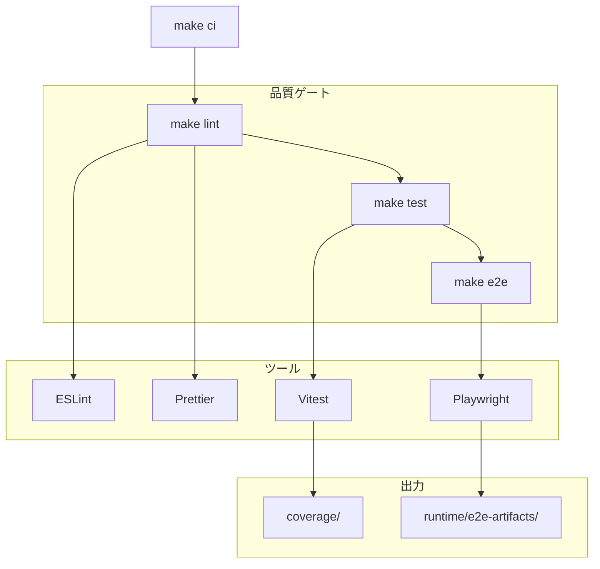

# Design Document: M2 - 品質ゲート

## Overview

AgentCompanyの品質ゲートシステムを構築する。lint（ESLint + Prettier）、test（Vitest）、e2e（Playwright）の3段階のゲートを設け、`make ci`で一括実行できるようにする。E2E失敗時には成果物（スクリーンショット、動画）を保存し、デバッグを容易にする。

## Architecture



## Components and Interfaces

### 1. Lint Configuration

```json
// .eslintrc.json（既存を拡張）
{
  "root": true,
  "parser": "@typescript-eslint/parser",
  "plugins": ["@typescript-eslint"],
  "extends": ["eslint:recommended", "plugin:@typescript-eslint/recommended"],
  "rules": {
    "@typescript-eslint/explicit-function-return-type": "warn",
    "@typescript-eslint/no-unused-vars": ["error", { "argsIgnorePattern": "^_" }],
    "no-console": "warn"
  },
  "ignorePatterns": ["dist", "node_modules", "runtime", "coverage"]
}
```

```json
// .prettierrc（既存を確認）
{
  "semi": true,
  "singleQuote": true,
  "tabWidth": 2,
  "trailingComma": "es5"
}
```

### 2. Test Configuration

```typescript
// vitest.config.ts（既存を拡張）
import { defineConfig } from 'vitest/config';

export default defineConfig({
  test: {
    globals: true,
    environment: 'node',
    include: ['tests/**/*.test.ts'],
    coverage: {
      provider: 'v8',
      reporter: ['text', 'json', 'html'],
      exclude: ['node_modules', 'dist', 'runtime', 'coverage'],
      thresholds: {
        lines: 80,
        functions: 80,
        branches: 80,
        statements: 80,
      },
    },
  },
});
```

### 3. E2E Configuration

```typescript
// playwright.config.ts
import { defineConfig, devices } from '@playwright/test';

export default defineConfig({
  testDir: './e2e',
  fullyParallel: true,
  forbidOnly: !!process.env.CI,
  retries: process.env.CI ? 2 : 0,
  workers: process.env.CI ? 1 : undefined,
  reporter: 'html',

  use: {
    trace: 'on-first-retry',
    screenshot: 'only-on-failure',
    video: 'on-first-retry',
  },

  outputDir: 'runtime/e2e-artifacts/',

  projects: [
    {
      name: 'chromium',
      use: { ...devices['Desktop Chrome'] },
    },
  ],
});
```

### 4. Package.json Scripts

```json
{
  "scripts": {
    "lint": "eslint . --ext .ts && prettier --check \"**/*.{ts,json,md,yaml}\"",
    "lint:fix": "eslint . --ext .ts --fix && prettier --write \"**/*.{ts,json,md,yaml}\"",
    "test": "vitest run --coverage",
    "test:watch": "vitest",
    "e2e": "playwright test",
    "e2e:ui": "playwright test --ui",
    "ci": "npm run lint && npm run test && npm run e2e"
  }
}
```

### 5. Makefile Updates

```makefile
# 静的解析
lint:
	npm run lint

# ユニットテスト
test:
	npm run test

# E2Eテスト
e2e:
	npm run e2e

# 全品質ゲート実行
ci: lint test e2e
	@echo "✅ All quality gates passed"
```

### 6. Sample E2E Test

```typescript
// e2e/cli-workflow.spec.ts
import { test, expect } from '@playwright/test';
import { exec } from 'child_process';
import { promisify } from 'util';

const execAsync = promisify(exec);

test.describe('CLI Workflow', () => {
  test('should validate agent definition', async () => {
    const { stdout, stderr } = await execAsync(
      'npx tsx tools/cli/validator.ts agents/registry/coo_pm.yaml'
    );
    expect(stderr).toBe('');
    expect(stdout).toContain('valid');
  });
});
```

## Data Models

### TestResult

```typescript
interface TestResult {
  name: string;
  status: 'passed' | 'failed' | 'skipped';
  duration: number;
  error?: string;
}
```

### CoverageReport

```typescript
interface CoverageReport {
  lines: { total: number; covered: number; percentage: number };
  functions: { total: number; covered: number; percentage: number };
  branches: { total: number; covered: number; percentage: number };
  statements: { total: number; covered: number; percentage: number };
}
```

### E2EArtifact

```typescript
interface E2EArtifact {
  testName: string;
  timestamp: string;
  type: 'screenshot' | 'video' | 'trace';
  path: string;
}
```

## Correctness Properties

### Property 1: Lint Determinism

_For any_ codebase state, running `make lint` multiple times SHALL produce the same result (pass or fail with same errors).

**Validates: Requirements 1.1, 1.2**

### Property 2: Test Isolation

_For any_ test execution, each test SHALL be independent and not affect other tests' results.

**Validates: Requirements 2.1**

### Property 3: Artifact Completeness

_For any_ E2E test failure, the system SHALL produce at least one screenshot artifact.

**Validates: Requirements 4.1, 4.2**

### Property 4: CI Gate Ordering

_For any_ `make ci` execution, gates SHALL run in order: lint → test → e2e, and stop on first failure.

**Validates: Requirements 5.1, 5.2**

## Error Handling

| エラー状況         | 対応                                   |
| ------------------ | -------------------------------------- |
| ESLint設定エラー   | エラーメッセージ表示、exit code 1      |
| テストタイムアウト | タイムアウトエラー表示、該当テストfail |
| Playwright起動失敗 | ブラウザインストール案内表示           |
| カバレッジ閾値未達 | 警告表示（デフォルトではfailしない）   |
| 成果物保存失敗     | 警告表示、テスト自体は続行             |

## Testing Strategy

### Unit Tests

- ESLint設定の妥当性テスト
- Vitest設定の妥当性テスト

### Integration Tests

- `make lint` の実行テスト
- `make test` の実行テスト
- `make ci` の統合テスト

### E2E Tests

- CLI validator の動作確認
- ワークフロー実行の動作確認

## Directory Structure

```
agent-company/
├── e2e/                          # E2Eテスト
│   └── cli-workflow.spec.ts
├── tests/                        # ユニットテスト（既存）
├── coverage/                     # カバレッジレポート出力
├── runtime/
│   └── e2e-artifacts/           # E2E成果物
│       ├── screenshots/
│       └── videos/
├── playwright.config.ts          # Playwright設定
├── vitest.config.ts              # Vitest設定（既存）
└── .eslintrc.json                # ESLint設定（既存）
```
