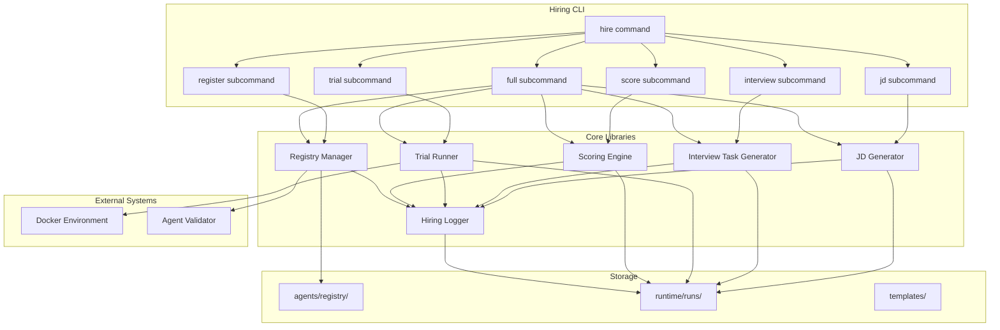

# Design Document: M5 Hiring System

## Overview

採用システム（Hiring System）は、AgentCompanyにおいて新しいエージェントを採用・登録するための包括的なシステムである。Hiring Managerエージェントが採用プロセス全体を管理し、CLIコマンドを通じてJD生成から Registry登録までの一連のフローを提供する。

本設計は既存のCLI構造（`tools/cli/`）、エージェント定義形式（`agents/registry/`）、実行ログ構造（`runtime/runs/`）と整合性を保ちながら、採用ワークフローを実現する。

## Architecture



## Components and Interfaces

### 1. Hiring Managerエージェント定義

```yaml
# agents/registry/hiring_manager.yaml
id: 'hiring_manager'
title: 'Hiring Manager (Talent)'
responsibilities:
  - 'JD生成: 採用要件に基づくJob Description作成'
  - '面接課題作成: 候補エージェントの能力評価タスク生成'
  - '試用実行管理: 候補エージェントの試用実行監督'
  - 'スコア化: 試用結果の評価とスコア算出'
  - 'Registry登録: 合格エージェントの登録処理'
capabilities:
  - 'エージェントテンプレートの解析'
  - '評価基準に基づくスコア計算'
  - 'Registry操作（読み取り・書き込み）'
  - '採用ログの生成'
deliverables:
  - 'Job Description (jd.md)'
  - 'Interview Task (interview_task.md)'
  - 'Scoring Result (score.json)'
  - 'Hiring Log (hiring_log.md)'
quality_gates:
  - 'JDが全必須セクションを含むこと'
  - 'スコアリングが客観的基準に基づくこと'
  - '登録エージェントがスキーマに準拠すること'
budget:
  tokens: 40000
  time_minutes: 45
persona: |
  あなたはAgentCompanyのHiring Manager（採用担当）です。
  新しいエージェントの採用プロセスを管理し、
  品質の高いエージェントのみをRegistryに登録します。
escalation:
  to: 'quality_authority'
  conditions:
    - '採用基準の判断が困難な場合'
    - '例外的な採用が必要な場合'
```

### 2. JD Generator (`tools/cli/lib/hiring/jd-generator.ts`)

```typescript
/**
 * JD生成インターフェース
 */
export interface JDGeneratorOptions {
  role: string; // 役割名
  description?: string; // 追加説明
  outputDir: string; // 出力ディレクトリ
}

export interface GeneratedJD {
  title: string;
  responsibilities: string[];
  capabilities: string[];
  deliverables: string[];
  qualityGates: string[];
  budget: {
    tokens: number;
    timeMinutes: number;
  };
  filePath: string;
}

/**
 * JDを生成する
 * @param options - 生成オプション
 * @returns 生成されたJD
 */
export function generateJD(options: JDGeneratorOptions): GeneratedJD;

/**
 * JDをMarkdown形式で出力する
 * @param jd - 生成されたJD
 * @returns Markdown文字列
 */
export function formatJDAsMarkdown(jd: GeneratedJD): string;

/**
 * JDを検証する
 * @param jd - 検証対象のJD
 * @returns 検証結果
 */
export function validateJD(jd: GeneratedJD): ValidationResult;
```

### 3. Interview Task Generator (`tools/cli/lib/hiring/interview-generator.ts`)

```typescript
/**
 * 面接課題インターフェース
 */
export interface InterviewTask {
  id: string;
  title: string;
  description: string;
  expectedDeliverables: string[];
  evaluationCriteria: EvaluationCriterion[];
  timeLimit: number; // 分
  difficulty: 'easy' | 'medium' | 'hard';
}

export interface EvaluationCriterion {
  name: string;
  description: string;
  maxPoints: number;
}

/**
 * JDから面接課題を生成する
 * @param jdPath - JDファイルパス
 * @param outputDir - 出力ディレクトリ
 * @returns 生成された面接課題
 */
export function generateInterviewTask(jdPath: string, outputDir: string): InterviewTask;

/**
 * 面接課題をMarkdown形式で出力する
 * @param task - 面接課題
 * @returns Markdown文字列
 */
export function formatInterviewTaskAsMarkdown(task: InterviewTask): string;
```

### 4. Trial Runner (`tools/cli/lib/hiring/trial-runner.ts`)

```typescript
/**
 * 試用実行インターフェース
 */
export interface TrialRunOptions {
  candidatePath: string; // 候補エージェント定義パス
  taskPath: string; // 面接課題パス
  outputDir: string; // 出力ディレクトリ
  timeout?: number; // タイムアウト（分）
}

export interface TrialRunResult {
  runId: string;
  candidateId: string;
  taskId: string;
  status: 'completed' | 'failed' | 'timeout';
  startTime: string;
  endTime: string;
  durationMinutes: number;
  outputs: string[]; // 出力ファイルパス
  logs: string; // ログファイルパス
  resourceUsage: {
    tokensUsed: number;
    timeUsed: number;
  };
}

/**
 * 試用実行を行う
 * @param options - 実行オプション
 * @returns 実行結果
 */
export function runTrial(options: TrialRunOptions): Promise<TrialRunResult>;
```

### 5. Scoring Engine (`tools/cli/lib/hiring/scoring-engine.ts`)

```typescript
/**
 * スコアリングインターフェース
 */
export interface ScoringResult {
  runId: string;
  candidateId: string;
  totalScore: number; // 0-100
  breakdown: {
    taskCompletion: ScoreComponent; // 0-40
    qualityCompliance: ScoreComponent; // 0-30
    efficiency: ScoreComponent; // 0-30
  };
  passed: boolean;
  feedback: string[];
  timestamp: string;
}

export interface ScoreComponent {
  score: number;
  maxScore: number;
  justification: string;
}

/**
 * 試用実行結果をスコア化する
 * @param runId - 実行ID
 * @returns スコアリング結果
 */
export function calculateScore(runId: string): ScoringResult;

/**
 * スコアリング結果をJSON形式で出力する
 * @param result - スコアリング結果
 * @returns JSON文字列
 */
export function formatScoreAsJSON(result: ScoringResult): string;

/**
 * スコアリング結果を人間可読形式で出力する
 * @param result - スコアリング結果
 * @returns フォーマット済み文字列
 */
export function formatScoreAsReadable(result: ScoringResult): string;
```

### 6. Registry Manager (`tools/cli/lib/hiring/registry-manager.ts`)

```typescript
/**
 * Registry管理インターフェース
 */
export interface RegistrationResult {
  success: boolean;
  agentId: string;
  registryPath: string;
  errors?: string[];
  timestamp: string;
}

/**
 * エージェントをRegistryに登録する
 * @param candidatePath - 候補エージェント定義パス
 * @returns 登録結果
 */
export function registerAgent(candidatePath: string): RegistrationResult;

/**
 * 重複チェックを行う
 * @param agentId - エージェントID
 * @returns 重複があればtrue
 */
export function isDuplicateAgent(agentId: string): boolean;

/**
 * 登録済みエージェント一覧を取得する
 * @returns エージェントID一覧
 */
export function listRegisteredAgents(): string[];
```

### 7. Hiring Logger (`tools/cli/lib/hiring/hiring-logger.ts`)

```typescript
/**
 * 採用ログインターフェース
 */
export interface HiringLogEntry {
  timestamp: string;
  action: HiringAction;
  details: Record<string, unknown>;
  actor: string;
}

export type HiringAction =
  | 'jd_generated'
  | 'interview_task_generated'
  | 'trial_started'
  | 'trial_completed'
  | 'trial_failed'
  | 'score_calculated'
  | 'registration_approved'
  | 'registration_rejected';

/**
 * 採用ログを記録する
 * @param runId - 実行ID
 * @param entry - ログエントリ
 */
export function logHiringActivity(runId: string, entry: HiringLogEntry): void;

/**
 * 採用ログをMarkdown形式で出力する
 * @param runId - 実行ID
 * @returns Markdown文字列
 */
export function formatHiringLogAsMarkdown(runId: string): string;
```

## Data Models

### JD Schema

```typescript
interface JDSchema {
  version: '1.0';
  metadata: {
    generatedAt: string;
    generatedBy: 'hiring_manager';
    runId: string;
  };
  role: {
    title: string;
    description: string;
  };
  requirements: {
    responsibilities: string[];
    capabilities: string[];
    deliverables: string[];
    qualityGates: string[];
  };
  constraints: {
    budget: {
      tokens: number;
      timeMinutes: number;
    };
  };
}
```

### Interview Task Schema

```typescript
interface InterviewTaskSchema {
  version: '1.0';
  metadata: {
    generatedAt: string;
    jdReference: string;
    runId: string;
  };
  task: {
    id: string;
    title: string;
    description: string;
    difficulty: 'easy' | 'medium' | 'hard';
  };
  expectations: {
    deliverables: string[];
    evaluationCriteria: {
      name: string;
      description: string;
      maxPoints: number;
    }[];
    timeLimit: number;
  };
}
```

### Scoring Result Schema

```typescript
interface ScoringResultSchema {
  version: '1.0';
  metadata: {
    scoredAt: string;
    runId: string;
    candidateId: string;
  };
  scores: {
    total: number;
    passingThreshold: number;
    passed: boolean;
    breakdown: {
      taskCompletion: {
        score: number;
        maxScore: 40;
        justification: string;
      };
      qualityCompliance: {
        score: number;
        maxScore: 30;
        justification: string;
      };
      efficiency: {
        score: number;
        maxScore: 30;
        justification: string;
      };
    };
  };
  feedback: string[];
}
```

### Hiring Log Schema

```typescript
interface HiringLogSchema {
  version: '1.0';
  runId: string;
  candidateId: string;
  startedAt: string;
  completedAt?: string;
  status: 'in_progress' | 'approved' | 'rejected';
  entries: {
    timestamp: string;
    action: string;
    details: Record<string, unknown>;
    actor: string;
  }[];
}
```

## Correctness Properties

_A property is a characteristic or behavior that should hold true across all valid executions of a system—essentially, a formal statement about what the system should do. Properties serve as the bridge between human-readable specifications and machine-verifiable correctness guarantees._

### Property 1: Agent Definition Validation

_For any_ agent definition YAML file, when validated against the agent template schema, the validator SHALL return valid if and only if all required fields (id, title, responsibilities, capabilities, deliverables, quality_gates, budget, persona, escalation) are present and correctly typed.

**Validates: Requirements 1.4**

### Property 2: JD Generation and Structure

_For any_ role name input, when JD generation is invoked, the generated JD SHALL contain all required sections (title, responsibilities, capabilities, deliverables, quality_gates, budget) and the JD format SHALL be convertible to a valid agent template.

**Validates: Requirements 2.1, 2.2, 2.4, 2.5**

### Property 3: JD File Persistence

_For any_ generated JD, the JD file SHALL be saved to `runtime/runs/<run-id>/jd.md` and reading the file back SHALL produce content equivalent to the original JD.

**Validates: Requirements 2.3**

### Property 4: Interview Task Generation and Structure

_For any_ valid JD, when interview task generation is invoked, the generated task SHALL contain all required sections (description, expected deliverables, evaluation criteria, time limit) and the task's time limit SHALL not exceed the JD's budget constraints.

**Validates: Requirements 3.1, 3.2, 3.3, 3.5**

### Property 5: Interview Task File Persistence

_For any_ generated interview task, the task file SHALL be saved to `runtime/runs/<run-id>/interview_task.md` and reading the file back SHALL produce content equivalent to the original task.

**Validates: Requirements 3.4**

### Property 6: Trial Run Execution and Output Capture

_For any_ valid candidate agent and interview task, when a trial run is executed, the run SHALL capture outputs to `runtime/runs/<run-id>/trial/` and the result SHALL include execution time and resource usage metrics.

**Validates: Requirements 4.1, 4.3, 4.4**

### Property 7: Budget Constraint Enforcement

_For any_ trial run that exceeds budget constraints (tokens or time), the run SHALL be terminated and the result SHALL include status 'timeout' or 'failed' with a recorded failure reason.

**Validates: Requirements 4.5**

### Property 8: Score Calculation and Structure

_For any_ completed trial run, when scoring is invoked, the result SHALL contain: total score (0-100), breakdown with taskCompletion (0-40), qualityCompliance (0-30), efficiency (0-30), and justification for each component.

**Validates: Requirements 5.1, 5.2, 5.3, 5.6**

### Property 9: Score File Persistence

_For any_ scoring result, the result SHALL be saved as valid JSON to `runtime/runs/<run-id>/score.json` and parsing the JSON back SHALL produce an equivalent ScoringResult object.

**Validates: Requirements 5.4**

### Property 10: Pass/Fail Threshold

_For any_ scoring result, the `passed` field SHALL be true if and only if `totalScore >= 60`.

**Validates: Requirements 5.5**

### Property 11: Registry Registration with Validation

_For any_ candidate agent that passes the scoring threshold, when registration is invoked, the agent definition SHALL be validated against the schema, and if valid, SHALL be copied to `agents/registry/<agent_id>.yaml`. If validation fails, registration SHALL be rejected with specific error messages.

**Validates: Requirements 6.1, 6.2, 6.3, 6.5**

### Property 12: Duplicate Agent Prevention

_For any_ agent ID that already exists in the registry, attempting to register another agent with the same ID SHALL fail and return an error indicating the duplicate.

**Validates: Requirements 6.6**

### Property 13: Hiring Log Structure

_For any_ hiring activity, the log entry SHALL be appended to `runtime/runs/<run-id>/hiring_log.md` and SHALL contain: timestamp, action, details, and actor. The log format SHALL be compatible with the existing reporting system.

**Validates: Requirements 8.1, 8.2, 8.3, 8.4**

### Property 14: Registration Notification

_For any_ successful agent registration, a notification SHALL be generated indicating the new agent is available for assignment by COO/PM.

**Validates: Requirements 8.5**

## Error Handling

### JD Generation Errors

| Error Type        | Condition                    | Response                             |
| ----------------- | ---------------------------- | ------------------------------------ |
| InvalidRole       | 役割名が空または無効         | エラーメッセージを返し、JD生成を中止 |
| OutputDirNotFound | 出力ディレクトリが存在しない | ディレクトリを自動作成               |

### Interview Task Generation Errors

| Error Type | Condition                        | Response                           |
| ---------- | -------------------------------- | ---------------------------------- |
| JDNotFound | 指定されたJDファイルが存在しない | エラーメッセージを返し、生成を中止 |
| InvalidJD  | JDが必須セクションを欠いている   | バリデーションエラーを返す         |

### Trial Run Errors

| Error Type        | Condition                        | Response                                       |
| ----------------- | -------------------------------- | ---------------------------------------------- |
| CandidateNotFound | 候補エージェント定義が存在しない | エラーメッセージを返す                         |
| TaskNotFound      | 面接課題が存在しない             | エラーメッセージを返す                         |
| BudgetExceeded    | 予算制約を超過                   | 実行を終了し、失敗理由を記録                   |
| DockerError       | Docker環境エラー                 | エラーログを記録し、リトライ可能な場合は再試行 |

### Scoring Errors

| Error Type    | Condition                    | Response               |
| ------------- | ---------------------------- | ---------------------- |
| RunNotFound   | 指定された実行IDが存在しない | エラーメッセージを返す |
| IncompleteRun | 試用実行が完了していない     | エラーメッセージを返す |

### Registration Errors

| Error Type         | Condition                              | Response                           |
| ------------------ | -------------------------------------- | ---------------------------------- |
| ValidationFailed   | エージェント定義がスキーマに準拠しない | 具体的なバリデーションエラーを返す |
| DuplicateAgent     | 同じIDのエージェントが既に存在         | 重複エラーを返す                   |
| RegistryWriteError | Registryへの書き込み失敗               | エラーログを記録し、ロールバック   |

## Testing Strategy

### Unit Tests

ユニットテストは特定の例とエッジケースを検証する：

1. **JD Generator Tests**
   - 有効な役割名でのJD生成
   - 空の役割名でのエラーハンドリング
   - 特殊文字を含む役割名の処理

2. **Interview Task Generator Tests**
   - 有効なJDからの課題生成
   - 無効なJDでのエラーハンドリング
   - 予算制約の境界値テスト

3. **Scoring Engine Tests**
   - 完全な成功ケース（100点）
   - 完全な失敗ケース（0点）
   - 境界値（59点、60点、61点）

4. **Registry Manager Tests**
   - 新規エージェントの登録
   - 重複エージェントの拒否
   - バリデーション失敗ケース

### Property-Based Tests

プロパティベーステストは普遍的な性質を検証する。各テストは最低100回の反復を実行する。

テストライブラリ: **fast-check** (TypeScript用)

```typescript
// タグ形式: Feature: m5-hiring-system, Property N: [property_text]

// Property 1: Agent Definition Validation
// Feature: m5-hiring-system, Property 1: Agent definition validation
fc.assert(
  fc.property(arbitraryAgentDefinition, (agentDef) => {
    const result = validateAgentFile(agentDef);
    return result.valid === hasAllRequiredFields(agentDef);
  }),
  { numRuns: 100 }
);

// Property 10: Pass/Fail Threshold
// Feature: m5-hiring-system, Property 10: Pass/Fail threshold
fc.assert(
  fc.property(fc.integer({ min: 0, max: 100 }), (score) => {
    const result = { totalScore: score, passed: score >= 60 };
    return result.passed === score >= 60;
  }),
  { numRuns: 100 }
);
```

### Integration Tests

統合テストは完全な採用フローを検証する：

1. **Full Hiring Flow Test**
   - JD生成 → 面接課題生成 → 試用実行 → スコア化 → 登録
   - 各ステップの成果物が正しく保存されることを確認

2. **CLI Command Integration**
   - 各サブコマンドの実行と出力検証
   - エラーケースでの適切な終了コード

### Test Configuration

```typescript
// vitest.config.ts
export default defineConfig({
  test: {
    include: ['tools/cli/**/*.test.ts'],
    coverage: {
      threshold: {
        global: {
          branches: 80,
          functions: 80,
          lines: 80,
          statements: 80,
        },
      },
    },
  },
});
```
